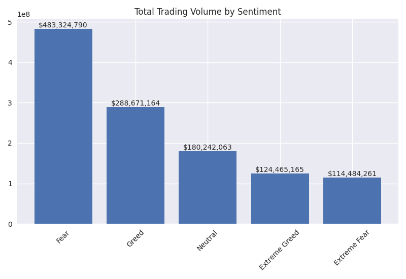

# Trader Behavior & Market Sentiment Analysis Report


## 1. Introduction

This report explores relationships between trader performance and Bitcoin market sentiment (Fear & Greed index).


## 2. Data

- Historical trader data: columns include Account, Timestamp IST, Size USD, Closed PnL, Execution Price, etc.

- Fear & Greed index: date, value, classification (e.g., Fear, Greed).


## 3. Preprocessing & Merging

Datasets were loaded, timestamps parsed, numeric columns converted, then merged on date with forward-filled missing sentiment/index.

- Merged dataset shape: (211224, 19)


## 4. Trader Metrics

- Trader metrics: 156 account-sentiment entries.

| Account                                    | Sentiment     |   Total_Trades |   Total_Volume_USD |        Total_PnL |   Avg_Trade_Size |   Win_Rate |   Avg_Fear_Greed_Value |
|:-------------------------------------------|:--------------|---------------:|-------------------:|-----------------:|-----------------:|-----------:|-----------------------:|
| 0x083384f897ee0f19899168e3b1bec365f52a9012 | Extreme Fear  |            100 |        1.5071e+06  | 124769           |          15071   |  0.37      |                17.8    |
| 0x083384f897ee0f19899168e3b1bec365f52a9012 | Extreme Greed |            945 |        1.14159e+07 | -40282.3         |          12080.3 |  0.0666667 |                78.3915 |
| 0x083384f897ee0f19899168e3b1bec365f52a9012 | Fear          |           1778 |        3.02624e+07 |      1.11337e+06 |          17020.5 |  0.526434  |                37.6496 |
| 0x083384f897ee0f19899168e3b1bec365f52a9012 | Greed         |            574 |        8.68699e+06 | 276719           |          15134.1 |  0.160279  |                71.7909 |
| 0x083384f897ee0f19899168e3b1bec365f52a9012 | Neutral       |            421 |        9.82488e+06 | 125650           |          23337   |  0.581948  |                50.4133 |


## 5. Aggregated Sentiment Patterns

| sentiment     |   Size USD_count |   Size USD_sum |   Size USD_mean |   Size USD_std |   Closed PnL_sum |   Closed PnL_mean |   Closed PnL_std |   Execution Price_mean |   Execution Price_std |   fear_greed_value_mean |
|:--------------|-----------------:|---------------:|----------------:|---------------:|-----------------:|------------------:|-----------------:|-----------------------:|----------------------:|------------------------:|
| Extreme Fear  |            21400 |    1.14484e+08 |         5349.73 |        22306.8 | 739110           |           34.5379 |         1136.06  |                 7054.8 |               22281.7 |                 19.6905 |
| Extreme Greed |            39992 |    1.24465e+08 |         3112.25 |        11062   |      2.71517e+06 |           67.8929 |          766.828 |                 6082.2 |               23201.2 |                 79.553  |
| Fear          |            61837 |    4.83325e+08 |         7816.11 |        51914.9 |      3.35716e+06 |           54.2904 |          935.355 |                14152.6 |               31644.4 |                 33.2025 |
| Greed         |            50309 |    2.88671e+08 |         5737.96 |        30532   |      2.1926e+06  |           43.5827 |         1120.06  |                13409.7 |               31513.8 |                 67.9783 |
| Neutral       |            37686 |    1.80242e+08 |         4782.73 |        37461.9 |      1.29292e+06 |           34.3077 |          517.122 |                12393.7 |               31286.4 |                 48.6612 |


## 6. Visualizations




## 7. Insights

```

Market Sentiment Distribution:

  Fear: 61837 trades (29.3%)

  Greed: 50309 trades (23.8%)

  Extreme Greed: 39992 trades (18.9%)

  Neutral: 37686 trades (17.8%)

  Extreme Fear: 21400 trades (10.1%)


Profitability by Sentiment:

  Extreme Fear: Total PnL=$739110.25, Avg PnL=$34.5379, Trades=21400

  Extreme Greed: Total PnL=$2715171.31, Avg PnL=$67.8929, Trades=39992

  Fear: Total PnL=$3357155.44, Avg PnL=$54.2904, Trades=61837

  Greed: Total PnL=$2192601.27, Avg PnL=$43.5827, Trades=50309

  Neutral: Total PnL=$1292920.68, Avg PnL=$34.3077, Trades=37686


Volume Analysis:

  Extreme Fear: Total Volume=$114484261.44, Avg Size=$5349.73

  Extreme Greed: Total Volume=$124465164.57, Avg Size=$3112.25

  Fear: Total Volume=$483324789.79, Avg Size=$7816.11

  Greed: Total Volume=$288671163.58, Avg Size=$5737.96

  Neutral: Total Volume=$180242063.08, Avg Size=$4782.73


Correlation Fear & Greed vs PnL: 0.0083

Correlation Fear & Greed vs Size: -0.0298


Most Profitable Sentiment: Extreme Greed

Highest Volume Sentiment: Fear

Lowest Risk Sentiment: Neutral


Actionable Insights:

  - Consider contrarian trades around extremes

  - Exploit volume opportunities during fear

  - Adjust risk management by sentiment

  - Monitor sentiment transitions for timing


Risk-Adjusted Returns:

  Extreme Fear: 0.0304

  Extreme Greed: 0.0885

  Fear: 0.0580

  Greed: 0.0389

  Neutral: 0.0663


Extreme Fear (<=25) Avg PnL: $34.7185

Extreme Greed (>=75) Avg PnL: $67.8929

```


## 8. Advanced Analyses

### output/predictive_report.txt
```

              precision    recall  f1-score   support

           0       0.94      0.96      0.95     31089
           1       0.94      0.91      0.92     21717

    accuracy                           0.94     52806
   macro avg       0.94      0.93      0.94     52806
weighted avg       0.94      0.94      0.94     52806

Confusion Matrix:
[[29769  1320]
 [ 1917 19800]]

```

### output/forecast_next10.csv
```

,predicted_mean
480,49.137132035391645
481,69.29100253568288
482,62.36660445303123
483,60.0432611720551
484,63.92383750774369
485,60.819710876015776
486,55.3874386975651
487,60.04367425196089
488,56.93951735898407
489,54.611399679002034


```

### output/anomalous_trades.csv
```

Size USD,Closed PnL,Execution Price,anomaly
22156.95,3008.231185,9.057,-1
40648.06,1545.740362,242.27,-1
27140.75,1026.702945,242.22,-1
19974.11,2370.488704,0.078734,-1
19869.35,7047.857251,0.13206,-1
14706.55,5209.367121,0.13196,-1
19903.7,2006.930852,0.12379,-1
20169.94,7525.631385,2.912,-1
28330.0,11655.0,2.833,-1
29272.05,13901.79413,2.711,-1
17884.98,9737.981968,2.5889,-1
11711.23,6376.508848,2.5889,-1
38563.98,10647.977,19.11,-1
18641.67,4336.75165,19.784,-1
24990.78,6068.114845,19.622,-1
27187.6,8904.42,18.37,-1
8306.58,3067.2796,17.81,-1
26729.6,9870.14273,17.81,-1
23710.0,8230.0,2371.0,-1
9288.3,2955.435055,18.5,-1
18281.37,14374.3311,133.12,-1
17413.15,5565.517755,18.48,-1
9505.12,3069.287575,18.434,-1
9110.0,3083.25,18.22,-1
18675.32,6320.600835,18.22,-1
31602.17,11749.70815,17.777,-1
15423.87,6280.355565,17.33,-1
36755.37,14966.20142,17.33,-1
32233.5,13735.0525,17.1,-1
59372.72,27223.7415,16.72,-1
9317.1,4665.14364,16.25,-1
16250.0,8136.5,16.25,-1
11849.66,5933.217165,16.25,-1
42000.24,21029.842,16.25,-1
7274.86,3516.405715,16.44,-1
7671.23,3707.99583,16.44,-1
18868.02,9120.118585,16.44,-1
6153.88,6016.2768,0.16055,-1
6581.25,4451.2875,1.95,-1
7179.1,11448.9135,8.2,-1
48661.88,10308.83318,25.054,-1
35021.75,7370.662955,25.01,-1
16983.37,3512.370652,24.895,-1
35179.85,7438.321805,25.041,-1
37568.41,7742.055582,24.872,-1
217804.66,0.0,82255.0,-1
240127.14,5041.52964,84019.0,-1
21299.48,2264.435214,14.428,-1
47470.49,976.1766,84347.0,-1
33738.8,693.8,84347.0,-1
48007.78,987.225365,84347.0,-1
33738.8,693.8,84347.0,-1
33738.8,693.8,84347.0,-1
53138.61,1092.735,84347.0,-1
116840.63,0.0,78706.0,-1
97220.38,-21333.46888,10.497,-1
24299.09,-5332.048524,10.497,-1
50030.13,1261.0008,76771.0,-1
61314.2,1538.04582,76780.0,-1
38887.52,973.92258,76783.0,-1
16092.95,403.04157,76783.0,-1
227584.52,993.9815,79450.0,-1
460952.22,2013.801309,79450.0,-1
373314.16,-29370.1198,81403.0,-1
35064.34,-2758.652225,81403.0,-1
226700.03,-17742.21655,81403.0,-1
249999.4,0.0,81166.0,-1
225263.72,0.0,81165.0,-1
68033.34,654.335964,80392.0,-1
80392.0,773.2,80392.0,-1
223082.98,2145.583608,80392.0,-1
76924.69,739.851884,80392.0,-1
281125.2,2703.826276,80392.0,-1
34990.62,336.5353,80392.0,-1
34990.62,336.5353,80392.0,-1
47420.03,456.079752,80392.0,-1
269454.62,0.0,78837.0,-1
169056.49,0.0,78837.0,-1
138468.52,0.0,78837.0,-1
138468.52,0.0,78837.0,-1
212355.34,0.0,78837.0,-1
212355.34,0.0,78837.0,-1
78484.06,277.76,79117.0,-1
123295.93,436.352,79117.0,-1
1186755.0,4200.0,79117.0,-1
50009.06,176.9852,79117.0,-1
53175.33,188.1908,79117.0,-1
148023.16,523.8632,79117.0,-1
101639.3,0.0,79384.0,-1
396965.09,0.0,79380.0,-1
414789.74,0.0,79378.0,-1
79048.0,333.2,79048.0,-1
130562.79,550.343108,79048.0,-1
62956.99,265.373808,79048.0,-1
56445.01,237.924792,79048.0,-1
155990.95,657.526884,79048.0,-1
156004.39,657.583528,79048.0,-1
86952.8,366.52,79048.0,-1
69562.24,293.216,79048.0,-1
53833.27,226.915864,79048.0,-1
53833.27,226.915864,79048.0,-1
84014.59,354.134956,79048.0,-1
84014.59,354.134956,79048.0,-1
53456.21,225.3265,79048.0,-1
49959.13,210.585732,79048.0,-1
86952.8,366.52,79048.0,-1
266271.61,1122.377536,79048.0,-1
39524.0,166.6,79048.0,-1
157422.19,0.0,83861.0,-1
801751.41,0.0,83861.0,-1
483955.96,0.0,83861.0,-1
75166.94,391.795404,84300.0,-1
154843.93,807.098708,84300.0,-1
252900.0,1318.2,84300.0,-1
1074631.95,5601.343774,84300.0,-1
602564.6,3140.769684,84300.0,-1
225453.09,0.0,83256.0,-1
288887.36,0.0,83255.0,-1
111921.36,0.0,83255.0,-1
114195.1,0.0,83252.0,-1
149999.85,0.0,83250.0,-1
149999.71,0.0,83249.0,-1
149999.44,0.0,83247.0,-1
288887.9,0.0,83247.0,-1
3509752.98,2147.115209,83203.0,-1
104504.98,0.0,83194.0,-1
149999.59,0.0,83170.0,-1
149999.86,0.0,83166.0,-1
208267.62,0.0,83166.0,-1
149999.3,0.0,83162.0,-1
128332.51,0.0,83160.0,-1
149999.57,0.0,83158.0,-1
191475.65,0.0,83157.0,-1
618900.17,0.0,83156.0,-1
199766.58,0.0,83155.0,-1
149999.84,0.0,83154.0,-1
825180.38,0.0,83154.0,-1
136731.45,0.0,83412.0,-1
113792.09,0.0,83410.0,-1
113922.29,0.0,83407.0,-1
149999.94,0.0,83269.0,-1
149999.54,0.0,83266.0,-1
149999.82,0.0,83262.0,-1
199965.77,0.0,83292.0,-1
145235.27,0.0,83290.0,-1
460400.87,0.0,83335.0,-1
131908.25,-48.31688,83267.0,-1
96891.14,-41.306025,83272.0,-1
121004.83,-53.038515,83273.0,-1
149999.79,-67.548,83274.0,-1
200060.6,-94.89401,83276.0,-1
119323.45,-58.030425,83277.0,-1
149999.5,-74.749385,83278.0,-1
149883.88,-76.49065,83279.0,-1
149999.91,-80.150285,83281.0,-1
98284.28,-56.055225,83284.0,-1
149894.68,-87.28933,83285.0,-1
149999.62,-87.35044,83285.0,-1
203969.86,-123.6745,83287.0,-1
127613.04,-78.907785,83288.0,-1
149999.32,-94.549875,83289.0,-1
288887.9,-182.09625,83289.0,-1
149905.48,-98.08801,83291.0,-1
149999.73,-99.949395,83292.0,-1
826549.83,-550.75536,83292.0,-1
149999.86,-101.749155,83293.0,-1
150000.0,-103.548875,83294.0,-1
127689.7,-88.1475,83294.0,-1
538584.83,-371.799025,83294.0,-1
191657.63,-134.605575,83295.0,-1
149914.47,-107.08691,83296.0,-1
100038.03,-72.65929,83297.0,-1
149999.71,-110.74674,83298.0,-1
120015.76,-88.6092,83298.0,-1
127612.97,-98.810775,83301.0,-1
83301.0,-64.5,83301.0,-1
149925.27,-117.88559,83302.0,-1
149999.41,-117.943885,83302.0,-1
239219.19,-188.097005,83302.0,-1
483084.26,0.0,82878.0,-1
139999.18,0.0,82878.0,-1
249999.83,0.0,82878.0,-1
165756.0,0.0,82878.0,-1
290942.15,0.0,82881.0,-1
73039.88,178.902955,83082.0,-1
199953.54,487.362825,83081.0,-1
117326.41,284.560315,83080.0,-1
88608.14,214.90781,83080.0,-1
288887.28,697.19063,83079.0,-1
149999.68,358.401675,83077.0,-1
55063.44,131.5658,83077.0,-1
79206.91,186.399475,83074.0,-1
127075.81,299.050485,83074.0,-1
55199.35,129.90193,83074.0,-1
98337.19,231.419215,83074.0,-1
149999.93,351.19698,83073.0,-1
60027.72,140.543755,83073.0,-1
288887.86,672.90786,83072.0,-1
249999.18,0.0,82938.0,-1
206253.53,0.0,82944.0,-1
288887.81,0.0,82947.0,-1
149999.85,0.0,82948.0,-1
103993.59,0.0,82950.0,-1
150062.36,0.0,82950.0,-1
127090.06,0.0,82951.0,-1
195503.89,0.0,82951.0,-1
149999.61,0.0,82952.0,-1
50003.38,331.104165,83499.0,-1
45924.45,304.095,83499.0,-1
249999.35,1655.404716,83499.0,-1
997382.2,6604.302036,83499.0,-1
45924.45,304.095,83499.0,-1
46970.69,311.022837,83499.0,-1
36739.56,243.276,83499.0,-1
299998.55,1986.481236,83499.0,-1
127307.59,842.984514,83499.0,-1
499997.02,3310.798374,83499.0,-1
44383.06,293.888466,83499.0,-1
58627.15,388.207677,83499.0,-1
158903.76,0.0,83601.0,-1
428608.45,0.0,83604.0,-1
249201.79,0.0,83604.0,-1
149999.91,0.0,83605.0,-1
149999.2,0.0,83606.0,-1
150088.78,0.0,83607.0,-1
149999.68,0.0,83610.0,-1
288887.71,0.0,83611.0,-1
40999.29,190.899821,83996.0,-1
104386.03,486.039525,83996.0,-1
303146.6,1411.503366,83996.0,-1
38887.17,180.604597,83995.0,-1
80083.13,370.033945,83993.0,-1
201085.96,929.142448,83993.0,-1
126923.5,586.465672,83993.0,-1
199992.65,919.350432,83991.0,-1
80079.31,366.220145,83989.0,-1
137509.35,627.230475,83988.0,-1
70291.24,320.624052,83988.0,-1
36954.72,168.564,83988.0,-1
150092.44,684.626517,83988.0,-1
288887.56,1314.297907,83987.0,-1
39999.65,181.978946,83987.0,-1
50111.93,227.390937,83986.0,-1
36953.84,167.684,83986.0,-1
80075.5,362.406345,83985.0,-1
126156.57,569.465065,83984.0,-1
126923.34,572.926248,83984.0,-1
49067.65,221.489175,83984.0,-1
142169.78,640.062804,83983.0,-1
126873.94,0.0,83998.0,-1
264610.92,0.0,84004.0,-1
288887.39,0.0,84006.0,-1
126887.53,0.0,84007.0,-1
150128.18,0.0,84008.0,-1
200033.97,0.0,84008.0,-1
130167.04,0.0,84008.0,-1
149999.86,0.0,84010.0,-1
428606.48,0.0,84011.0,-1
169504.02,0.0,83600.0,-1
333179.44,0.0,83600.0,-1
140821.69,0.0,83600.0,-1
301808.54,0.0,83600.0,-1
500003.18,0.0,83710.0,-1
2268415.35,19530.5225,84590.0,-1
39587.27,340.837117,84590.0,-1
1168370.61,10059.39613,84590.0,-1
74716.66,643.292824,84590.0,-1
49157.79,423.236979,84590.0,-1
250024.35,2152.650876,84590.0,-1
901040.84,7757.749638,84590.0,-1
263113.81,2265.348018,84590.0,-1
139996.52,0.0,84971.0,-1
38978.4,293.239407,85616.0,-1
134854.62,1014.528351,85616.0,-1
96000.36,722.222889,85616.0,-1
81621.99,605.536095,85607.0,-1
81618.18,601.722295,85603.0,-1
149960.19,1105.567291,85603.0,-1
125111.6,920.922655,85602.0,-1
216306.84,1592.193389,85602.0,-1
37664.88,277.244,85602.0,-1
138417.22,0.0,85542.0,-1
249999.92,0.0,85542.0,-1
94182.87,159.266835,85687.0,-1
91464.87,154.670607,85687.0,-1
81696.36,136.248005,85685.0,-1
64943.23,108.308197,85685.0,-1
99999.23,165.607233,85684.0,-1
59792.17,98.324247,85683.0,-1
166124.55,271.245115,85682.0,-1
60009.96,97.983162,85682.0,-1
81692.55,132.434205,85681.0,-1
222797.32,0.0,85493.0,-1
158808.11,0.0,85497.0,-1
124870.04,0.0,85504.0,-1
149915.92,0.0,85505.0,-1
108071.89,0.0,85506.0,-1
199954.7,0.0,85507.0,-1
108578.47,0.0,85509.0,-1
124868.54,0.0,85510.0,-1
149928.19,0.0,85512.0,-1
149999.16,0.0,85512.0,-1
149999.25,0.0,85514.0,-1
149999.3,0.0,85515.0,-1
124868.75,0.0,85516.0,-1
149938.71,0.0,85518.0,-1
149999.47,0.0,85519.0,-1
108738.51,0.0,132.07,-1
149816.81,0.0,84500.0,-1
125529.82,0.0,84500.0,-1
141548.49,0.0,84500.0,-1
270560.55,0.0,84500.0,-1
258831.1,0.0,84500.0,-1
150491.21,0.0,83500.0,-1
417500.0,0.0,83500.0,-1
141737.07,0.0,83500.0,-1
716855.85,0.0,83500.0,-1
139986.59,-2762.143559,83050.0,-1
69008.74,-1362.492318,83049.0,-1
371997.84,1710.892729,85080.0,-1
72342.68,307.318167,85050.0,-1
69768.55,287.396629,85039.0,-1
50923.31,209.171319,85038.0,-1
81079.48,333.040085,85038.0,-1
300896.76,1235.956134,85038.0,-1
42519.0,174.65,85038.0,-1
49970.03,205.255666,85038.0,-1
62477.77,254.436999,85035.0,-1
63776.25,259.725,85035.0,-1
49969.97,203.499732,85035.0,-1
123639.19,503.513274,85035.0,-1
320724.81,1306.132784,85035.0,-1
108898.77,0.0,84575.0,-1
125312.04,0.0,84580.0,-1
269844.9,0.0,84593.0,-1
125312.48,0.0,84594.0,-1
149951.41,0.0,84595.0,-1
125312.48,0.0,84598.0,-1
49411.13,198.274608,85004.0,-1
138226.7,554.669532,85004.0,-1
96037.52,385.37478,85004.0,-1
46752.2,187.605,85004.0,-1
352632.29,1415.026062,85004.0,-1
125850.97,505.008783,85004.0,-1
200459.83,804.395664,85004.0,-1
96199.03,386.02287,85004.0,-1
42502.0,170.55,85004.0,-1
99999.56,401.273451,85004.0,-1
50001.05,200.641842,85004.0,-1
96068.12,385.497576,85004.0,-1
42502.0,170.55,85004.0,-1
112110.08,449.869968,85004.0,-1
344972.5,0.0,85000.0,-1
620295.15,0.0,85000.0,-1
339240.1,0.0,85000.0,-1
330207.39,2129.895726,85300.0,-1
215639.25,1390.911102,85300.0,-1
72952.82,470.55855,85300.0,-1
193242.89,1246.45059,85300.0,-1
93752.38,604.719318,85300.0,-1
46257.34,298.367958,85300.0,-1
34120.0,220.08,85300.0,-1
240235.51,1549.561272,85300.0,-1
34120.0,220.08,85300.0,-1
85300.0,550.2,85300.0,-1
407166.76,2626.29717,85300.0,-1
170600.0,1100.4,85300.0,-1
39052.9,251.898066,85300.0,-1
456085.45,2941.831368,85300.0,-1
558739.74,3603.969558,85300.0,-1
34120.0,220.08,85300.0,-1
158209.32,1020.477948,85300.0,-1
116417.44,750.91296,85300.0,-1
108323.32,698.704482,85300.0,-1
85300.0,550.2,85300.0,-1
75064.0,484.176,85300.0,-1
79127.69,510.387528,85300.0,-1
36379.6,234.654798,85300.0,-1
93023.06,600.015108,85300.0,-1
65279.24,421.062558,85300.0,-1
85300.0,550.2,85300.0,-1
304687.34,1965.28689,85300.0,-1
196179.76,1265.393976,85300.0,-1
206530.92,1332.160746,85300.0,-1
158574.41,1022.832804,85300.0,-1
210786.54,1359.610224,85300.0,-1
1632937.32,0.0,85644.0,-1
141615.78,0.0,85644.0,-1
246521.97,0.0,85644.0,-1
215269.62,0.0,85644.0,-1
215261.06,0.0,85644.0,-1
140446.74,0.0,85644.0,-1
247308.18,0.0,85644.0,-1
179299.6,138.28056,85578.0,-1
128648.55,99.21714,85578.0,-1
80058.3,60.80685,85579.0,-1
1390022.88,1039.51232,85580.0,-1
304380.09,220.50858,85582.0,-1
80062.04,57.06489,85583.0,-1
83742.97,59.6885,85583.0,-1
140257.63,98.3298,85584.0,-1
99252.92,68.4223,85585.0,-1
199869.84,135.44798,85586.0,-1
304401.42,199.16904,85588.0,-1
103066.78,67.43632,85588.0,-1
128665.09,82.68095,85589.0,-1
80069.52,49.58097,85591.0,-1
648277.33,0.0,85100.0,-1
299996.22,0.0,85100.0,-1
405361.09,0.0,85100.0,-1
131563.75,0.0,85100.0,-1
425500.0,0.0,85100.0,-1
401517.97,0.0,85100.0,-1
128730.37,0.0,84165.0,-1
672294.85,0.0,84167.0,-1
96039.53,-445.181688,84394.0,-1
56479.0,-261.802776,84394.0,-1
249999.5,-1158.847848,84394.0,-1
130674.91,0.0,84156.0,-1
288887.38,0.0,83964.0,-1
241322.58,1546.568622,85056.0,-1
38887.41,246.492693,85050.0,-1
42689.15,270.590463,85050.0,-1
42077.0,265.235475,85047.0,-1
103595.75,653.02341,85047.0,-1
200096.23,1258.98328,85046.0,-1
335423.43,2106.527787,85045.0,-1
288887.66,1814.273608,85045.0,-1
102360.16,642.84276,85045.0,-1
132466.24,830.367222,85044.0,-1
39999.59,250.738254,85044.0,-1
81283.99,507.630691,85042.0,-1
249864.45,1560.440843,85042.0,-1
46772.55,291.555,85041.0,-1
50800.6,315.476378,85039.0,-1
132439.74,822.46294,85039.0,-1
81280.17,503.807451,85038.0,-1
304917.36,1890.001386,85038.0,-1
37416.72,231.924,85038.0,-1
46770.35,289.355,85037.0,-1
576653.78,3560.855379,85036.0,-1
132439.46,816.270027,85035.0,-1
81275.39,499.028401,85033.0,-1
304895.84,1868.487426,85032.0,-1
270361.96,0.0,84728.0,-1
500006.25,0.0,84726.0,-1
499995.27,0.0,84725.0,-1
365644.98,0.0,84723.0,-1
328019.74,0.0,84720.0,-1
303777.12,0.0,84720.0,-1
137503.95,0.0,84720.0,-1
140673.43,0.0,84717.0,-1
234738.72,0.0,84716.0,-1
303755.6,0.0,84714.0,-1
316938.44,0.0,84713.0,-1
288887.4,0.0,84712.0,-1
179144.34,69.384136,84687.0,-1
236944.06,91.770464,84687.0,-1
99999.26,38.730568,84687.0,-1
94172.42,30.911932,84692.0,-1
282363.87,86.015394,84694.0,-1
163961.29,46.073944,84696.0,-1
199539.54,56.07161,84696.0,-1
193760.73,54.447736,84696.0,-1
148911.92,34.810578,84700.0,-1
303705.4,70.996068,84700.0,-1
276103.96,58.022838,84702.0,-1
303726.92,49.482108,84706.0,-1
132532.7,21.591756,84706.0,-1
132533.88,15.332688,84710.0,-1
288887.38,30.010376,84711.0,-1
149999.54,13.81146,84712.0,-1
132533.36,9.073984,84714.0,-1
179999.27,0.0,84753.0,-1
424037.06,0.0,84753.0,-1
202841.05,0.0,84753.0,-1
249999.31,0.0,84753.0,-1
199071.89,0.0,84754.0,-1
348826.15,0.0,84755.0,-1
200700.51,0.0,84756.0,-1
132430.27,0.0,84757.0,-1
176906.83,0.0,84760.0,-1
303924.13,0.0,84761.0,-1
199697.39,0.0,84763.0,-1
117574.14,0.0,84765.0,-1
288887.63,0.0,84767.0,-1
159167.18,0.0,84768.0,-1
81898.54,329.518912,85100.0,-1
68628.9,276.12848,85100.0,-1
255300.0,1027.2,85100.0,-1
42550.0,171.2,85100.0,-1
50000.51,201.17712,85100.0,-1
1499931.75,6034.978048,85100.0,-1
46805.0,188.32,85100.0,-1
66888.6,269.1264,85100.0,-1
46264.61,186.14576,85100.0,-1
46313.97,186.344352,85100.0,-1
87664.06,352.716512,85100.0,-1
140015.88,563.354144,85100.0,-1
74888.0,301.312,85100.0,-1
61174.14,246.13424,85100.0,-1
2133645.07,8584.724704,85100.0,-1
1788753.88,0.0,85134.0,-1
166990.34,0.0,85134.0,-1
191346.33,0.0,85134.0,-1
265017.03,0.0,85134.0,-1
115046.68,0.0,85134.0,-1
234012.08,0.0,85134.0,-1
184989.37,0.0,85134.0,-1
222517.29,0.0,85134.0,-1
133115.25,0.0,84967.0,-1
124007.06,0.0,84980.0,-1
304716.56,0.0,84982.0,-1
179998.62,0.0,84382.0,-1
249999.4,0.0,84382.0,-1
316306.32,0.0,84500.0,-1
291832.58,0.0,84500.0,-1
124869.87,0.0,84500.0,-1
161207.53,726.29787,85365.0,-1
38887.85,172.482588,85359.0,-1
149999.36,654.80724,85353.0,-1
80981.22,353.515428,85353.0,-1
149999.31,653.057272,85352.0,-1
304540.05,1322.334154,85351.0,-1
149999.16,647.807128,85349.0,-1
149999.91,644.310498,85347.0,-1
591956.55,2542.693608,85347.0,-1
80974.58,346.873968,85346.0,-1
149999.76,639.059724,85344.0,-1
132779.05,565.692516,85344.0,-1
37551.36,159.984,85344.0,-1
149999.66,635.559008,85342.0,-1
304507.94,1290.221344,85342.0,-1
188887.8,798.126798,85341.0,-1
80969.83,342.130068,85341.0,-1
50981.01,215.415228,85341.0,-1
132778.8,559.494448,85340.0,-1
149999.51,630.307634,85339.0,-1
591894.13,2480.270688,85338.0,-1
299999.56,1250.115356,85336.0,-1
51201.6,213.36,85336.0,-1
80963.19,335.488608,85334.0,-1
46933.15,193.93,85333.0,-1
132779.15,547.100148,85332.0,-1
50975.03,209.441428,85331.0,-1
591838.64,2424.783648,85330.0,-1
69510.71,283.976532,85329.0,-1
85329.0,348.6,85329.0,-1
304457.98,1240.268084,85328.0,-1
51329.06,209.09878,85328.0,-1
167042.11,678.528422,85327.0,-1
132779.05,539.351192,85327.0,-1
806404.08,3266.217216,85326.0,-1
115110.61,463.55076,85324.0,-1
45442.18,182.465334,85323.0,-1
722527.11,2901.184764,85323.0,-1
2834011.35,0.0,85000.0,-1
152211.2,0.0,85000.0,-1
96016.23,80.13486,85071.0,-1
188887.39,157.64485,85071.0,-1
249999.93,202.77651,85069.0,-1
80709.87,63.56826,85067.0,-1
101633.45,78.85416,85066.0,-1
188887.16,142.11392,85064.0,-1
79117.18,59.52576,85064.0,-1
243642.01,183.31008,85064.0,-1
80705.12,58.82436,85062.0,-1
147055.13,103.7304,85060.0,-1
80701.33,55.02924,85058.0,-1
115638.05,78.85216,85058.0,-1
244716.32,161.11872,85056.0,-1
179999.44,0.0,84994.0,-1
1026944.8,0.0,84997.0,-1
199963.55,0.0,84999.0,-1
2343571.55,0.0,85000.0,-1
365177.85,0.0,85000.0,-1
841787.3,0.0,85000.0,-1
157012.85,0.0,85000.0,-1
152256.43,0.0,84965.0,-1
149999.83,0.0,84966.0,-1
112078.27,0.0,84967.0,-1
167495.99,0.0,84969.0,-1
202044.39,0.0,84969.0,-1
88886.68,1558.377015,134.41,-1
74999.44,1314.903435,134.41,-1
112560.65,0.0,84453.0,-1
127852.55,0.0,84453.0,-1
133475.43,0.0,84453.0,-1
121826.83,0.0,84453.0,-1
118365.1,0.0,84453.0,-1
249999.46,0.0,84453.0,-1
163425.84,0.0,84453.0,-1
263071.94,0.0,84453.0,-1
132299.69,0.0,137.38,-1
175713.84,312.60792,137.15,-1
133554.06,227.84814,137.16,-1
197834.13,865.50547,85259.0,-1
60004.43,262.51367,85259.0,-1
179999.65,787.48133,85259.0,-1
136983.08,599.28791,85259.0,-1
265001.17,1159.35487,85259.0,-1
224290.85,981.2511,85259.0,-1
49987.35,218.6899,85259.0,-1
80892.03,353.89494,85259.0,-1
304211.79,1330.89757,85259.0,-1
73918.69,322.524,85258.0,-1
133589.19,581.3199,85257.0,-1
425039.66,1839.65319,85255.0,-1
80888.24,350.09982,85255.0,-1
133604.1,576.70384,85254.0,-1
38887.76,167.85952,85254.0,-1
86434.77,373.0968,85254.0,-1
644851.99,2775.98066,85253.0,-1
49999.18,215.23816,85253.0,-1
199983.93,860.89759,85253.0,-1
304190.38,1309.48903,85253.0,-1
67733.57,290.79066,85252.0,-1
100007.42,429.34728,85252.0,-1
133603.66,572.0207,85251.0,-1
768342.9,3280.66648,85250.0,-1
49982.08,213.4132,85250.0,-1
75834.1,322.91028,85249.0,-1
133596.4,567.3083,85248.0,-1
805666.91,3421.21132,85248.0,-1
805666.91,3421.21132,85248.0,-1
80881.6,343.45836,85248.0,-1
113352.94,480.0217,85247.0,-1
116487.47,493.29567,85247.0,-1
199904.22,846.545,85247.0,-1
64292.53,271.512,85246.0,-1
304165.4,1284.5124,85246.0,-1
133596.82,562.62839,85245.0,-1
656203.22,2763.52815,85245.0,-1
83724.95,351.62044,85244.0,-1
51490.18,215.64228,85243.0,-1
44028.86,184.39407,85243.0,-1
149999.55,628.20219,85243.0,-1
51022.2,213.68235,85243.0,-1
39999.43,167.51868,85243.0,-1
188887.75,788.8604,85242.0,-1
102781.04,428.04835,85241.0,-1
250000.0,0.0,85021.0,-1
187366.0,0.0,85028.0,-1
111262.54,0.0,85028.0,-1
154798.94,0.0,85031.0,-1
761697.33,0.0,84900.0,-1
271680.0,0.0,84900.0,-1
203377.95,0.0,84900.0,-1
169159.85,0.0,84900.0,-1
420333.11,0.0,84900.0,-1
608589.52,0.0,84900.0,-1
108291.65,0.0,84900.0,-1
899095.24,0.0,84900.0,-1
222338.67,0.0,84900.0,-1
118020.34,0.0,84900.0,-1
128744.75,0.0,138.07,-1
105709.91,0.0,138.08,-1
135561.57,0.0,138.09,-1
309611.91,0.0,138.1,-1
3279596.7,10024.26205,85194.0,-1
99999.62,289.268672,85180.0,-1
57783.05,165.796072,85178.0,-1
49999.75,142.878234,85177.0,-1
61009.01,173.623848,85176.0,-1
54472.18,153.745416,85174.0,-1
106123.85,298.287612,85173.0,-1
80808.54,225.240372,85171.0,-1
53527.42,149.198778,85171.0,-1
303897.79,847.064566,85171.0,-1
51102.0,141.84,85170.0,-1
106609.84,295.908972,85170.0,-1
200462.07,556.407588,85170.0,-1
49934.0,137.42872,85168.0,-1
149999.58,412.829968,85168.0,-1
200384.12,551.498664,85168.0,-1
80804.75,221.445252,85167.0,-1
149999.47,409.316824,85166.0,-1
303872.82,822.087936,85164.0,-1
133167.54,360.267264,85164.0,-1
542631.38,1461.663392,85163.0,-1
146785.08,0.0,85198.0,-1
303997.7,0.0,85199.0,-1
149999.71,0.0,85200.0,-1
149999.88,0.0,85203.0,-1
149999.94,0.0,85204.0,-1
572138.9,0.0,85204.0,-1
149999.99,0.0,85205.0,-1
149999.2,0.0,85206.0,-1
304026.24,0.0,85207.0,-1
149999.31,0.0,85208.0,-1
149999.37,0.0,85209.0,-1
149999.42,0.0,85210.0,-1
572192.62,0.0,85212.0,-1
251580.76,0.0,85212.0,-1
1908223.65,0.0,85000.0,-1
425000.0,0.0,85000.0,-1
787334.6,0.0,85000.0,-1
102506.13,0.0,84250.0,-1
294875.0,0.0,84250.0,-1
1425947.7,0.0,84526.0,-1
179953.07,436.37019,85199.0,-1
94315.29,228.7062,85199.0,-1
96083.17,232.99315,85199.0,-1
50031.41,121.321718,85199.0,-1
60017.58,145.537304,85199.0,-1
200123.29,482.937952,85198.0,-1
80834.16,195.069168,85198.0,-1
179952.66,434.262152,85198.0,-1
308233.58,743.82996,85198.0,-1
249999.9,603.300304,85198.0,-1
63668.47,153.64488,85198.0,-1
521115.27,1257.556512,85198.0,-1
49999.56,120.073602,85197.0,-1
242011.73,575.521768,85195.0,-1
80830.36,191.274048,85194.0,-1
303979.86,719.326944,85194.0,-1
49949.24,118.19808,85194.0,-1
154764.9,362.605336,85192.0,-1
83746.29,196.212788,85192.0,-1
168662.27,395.166084,85192.0,-1
80825.62,186.530148,85189.0,-1
805109.31,1858.039076,85189.0,-1
303958.45,697.918404,85188.0,-1
64508.61,148.1181,85188.0,-1
50739.68,116.503272,85188.0,-1
188887.69,431.492418,85187.0,-1
607668.26,1359.679408,85183.0,-1
303937.04,676.509864,85182.0,-1
80818.98,179.888688,85182.0,-1
188887.68,420.430416,85182.0,-1
805033.71,1782.432196,85181.0,-1
149999.42,330.357972,85180.0,-1
80815.18,176.093568,85178.0,-1
149999.31,326.843456,85178.0,-1
89924.77,194.889604,85177.0,-1
303915.63,655.101324,85176.0,-1
801167.16,1726.945272,85176.0,-1
249999.43,0.0,86740.0,-1
155958.01,0.0,86732.0,-1
183921.08,0.0,86727.0,-1
309449.74,0.0,86727.0,-1
149999.57,0.0,86722.0,-1
427751.93,0.0,86722.0,-1
309428.33,0.0,86721.0,-1
149999.6,0.0,86717.0,-1
149999.6,0.0,86716.0,-1
149999.61,0.0,86714.0,-1
58242.29,1421.409907,141.54,-1
41909.99,1022.81823,141.54,-1
39965.25,969.84632,141.52,-1
48736.04,1179.32892,141.51,-1
131931.19,3192.509133,141.51,-1
131930.36,3183.390891,141.5,-1
59296.99,1430.796558,141.5,-1
49363.69,1191.112698,141.5,-1
40536.92,978.128664,141.5,-1
78549.48,1895.346216,141.5,-1
103136.52,2488.614984,141.5,-1
131603.51,0.0,140.12,-1
323511.12,0.0,140.13,-1
129960.77,0.0,140.13,-1
89649.51,-643.381201,87353.0,-1
59999.28,-430.592534,87353.0,-1
57187.17,-413.660697,87358.0,-1
102582.75,-742.027532,87358.0,-1
149999.77,-1086.720945,87359.0,-1
82884.47,-600.482862,87359.0,-1
203364.47,-1475.649471,87360.0,-1
102621.22,-745.804332,87361.0,-1
399999.15,-2911.557176,87362.0,-1
82888.27,-604.277982,87363.0,-1
149999.62,-1095.242405,87364.0,-1
70188.24,-512.48886,87364.0,-1
50446.0,-369.484659,87366.0,-1
188887.87,-1387.774962,87368.0,-1
149999.47,-1103.762865,87369.0,-1
51224.44,-376.93227,87369.0,-1
82893.96,-609.970662,87369.0,-1
63987.17,-471.573043,87370.0,-1
99998.13,-739.239009,87372.0,-1
82897.75,-613.765782,87373.0,-1
825759.44,-6123.212194,87374.0,-1
149999.31,-576.320008,87374.0,-1
825787.79,0.0,87377.0,-1
259367.61,0.0,87378.0,-1
616395.87,0.0,87378.0,-1
399999.22,0.0,87379.0,-1
149999.16,0.0,87379.0,-1
149999.88,0.0,87384.0,-1
299993.52,0.0,87386.0,-1
616451.43,0.0,87386.0,-1
149999.72,0.0,87389.0,-1
112172.52,0.0,87389.0,-1
38092.91,181.78734,87800.0,-1
61521.46,293.5933,87800.0,-1
3921430.72,18713.88918,87800.0,-1
355344.47,0.0,87850.0,-1
343326.59,0.0,87850.0,-1
218520.73,0.0,87850.0,-1
611062.64,0.0,87850.0,-1
260264.41,0.0,87850.0,-1
161374.3,0.0,87850.0,-1
534889.66,0.0,87850.0,-1
3719140.94,0.0,87400.0,-1
726707.26,0.0,86700.0,-1
252446.12,0.0,86700.0,-1
260100.0,0.0,86700.0,-1
304399.36,0.0,86700.0,-1
163921.96,0.0,86700.0,-1
557227.84,0.0,86700.0,-1
111827.39,0.0,86700.0,-1
331140.9,669.54881,87490.0,-1
75440.88,152.537332,87490.0,-1
2423217.53,4899.613452,87490.0,-1
87648.36,177.220189,87490.0,-1
102051.84,206.343236,87490.0,-1
142700.56,288.532745,87490.0,-1
473518.63,957.428794,87490.0,-1
1905487.58,3852.791781,87490.0,-1
473518.63,957.428794,87490.0,-1
1170611.83,2366.913155,87490.0,-1
473518.63,957.428794,87490.0,-1
473518.63,957.428794,87490.0,-1
473518.63,957.428794,87490.0,-1
473518.63,957.428794,87490.0,-1
99732.48,201.653617,87490.0,-1
100221.54,202.642488,87490.0,-1
128909.52,260.647998,87490.0,-1
59216.54,718.732791,140.5,-1
73465.03,886.506276,140.49,-1
74951.7,899.174962,140.48,-1
131917.74,1582.580965,140.48,-1
83123.42,997.208863,140.48,-1
102293.32,1227.184901,140.48,-1
51163.39,610.194519,140.47,-1
74652.78,890.338185,140.47,-1
131918.19,1573.307736,140.47,-1
82496.63,983.886937,140.47,-1
131917.22,1564.016454,140.46,-1
96479.16,1143.861264,140.46,-1
1395880.37,0.0,90650.0,-1
179886.73,0.0,90687.0,-1
149999.98,0.0,90698.0,-1
149999.28,0.0,90708.0,-1
290091.44,0.0,90708.0,-1
203450.69,0.0,90712.0,-1
149999.33,0.0,90719.0,-1
99999.5,529.891616,91188.0,-1
40118.76,208.648,91179.0,-1
197950.52,1029.492942,91179.0,-1
199037.02,1032.97194,91178.0,-1
252296.72,1301.123334,91175.0,-1
249999.11,1289.274294,91175.0,-1
256508.93,1320.04728,91174.0,-1
82172.43,419.289412,91170.0,-1
188887.58,961.748128,91169.0,-1
45584.5,232.1,91169.0,-1
49999.81,254.581206,91169.0,-1
69999.22,353.355366,91165.0,-1
149999.96,750.649728,91161.0,-1
399999.14,1997.362976,91160.0,-1
82161.62,408.473692,91158.0,-1
50770.8,251.857312,91157.0,-1
399999.65,1984.267166,91157.0,-1
3641180.84,18022.9584,91156.0,-1
2825834.19,0.0,91175.0,-1
500002.79,0.0,91175.0,-1
249999.11,0.0,91175.0,-1
867507.05,-28.54518,91172.0,-1
200064.73,-8.77756,91171.0,-1
742214.91,-32.56364,91171.0,-1
124262.32,0.0,91000.0,-1
249999.75,0.0,91000.0,-1
218708.49,0.0,91000.0,-1
416548.86,0.0,91000.0,-1
454527.71,0.0,91000.0,-1
402095.33,0.0,91000.0,-1
420623.0,0.0,91001.0,-1
452359.6,0.0,91001.0,-1
335930.19,0.0,91001.0,-1
214877.02,0.0,91001.0,-1
172059.69,112.804344,91060.0,-1
194446.76,121.079448,91057.0,-1
188887.12,105.178164,91051.0,-1
84261.3,45.069415,91049.0,-1
149999.93,76.93825,91047.0,-1
125915.24,61.8201,91045.0,-1
149999.89,68.704503,91042.0,-1
188887.72,80.29476,91039.0,-1
149999.84,60.469856,91037.0,-1
149999.28,57.175537,91035.0,-1
149999.45,55.528501,91034.0,-1
149999.97,50.587153,91031.0,-1
91031.0,30.7,91031.0,-1
149999.41,47.292434,91029.0,-1
199854.33,58.621185,91027.0,-1
149999.92,42.350516,91026.0,-1
245192.16,0.0,93263.0,-1
153584.58,0.0,93263.0,-1
249999.87,0.0,93263.0,-1
279757.29,0.0,93263.0,-1
500002.53,0.0,93263.0,-1
126729.49,0.0,93263.0,-1
800948.43,0.0,93264.0,-1
200073.01,0.0,93265.0,-1
139883.51,0.0,93265.0,-1
299342.8,0.0,93316.0,-1
299365.25,0.0,93323.0,-1
117841.15,0.0,93324.0,-1
119191.64,0.0,93327.0,-1
299384.5,0.0,93329.0,-1
149999.46,0.0,93332.0,-1
149999.87,0.0,93334.0,-1
299403.75,0.0,93335.0,-1
256131.66,0.0,93337.0,-1
62996.09,297.910899,93740.0,-1
40600.24,191.568976,93739.0,-1
40386.08,190.129692,93738.0,-1
106830.18,501.801104,93737.0,-1
300690.09,1409.204112,93736.0,-1
49999.19,233.793603,93735.0,-1
178792.01,836.022186,93735.0,-1
113695.59,530.427408,93734.0,-1
38887.42,181.422651,93734.0,-1
256168.54,1192.390448,93733.0,-1
127172.77,590.601981,93732.0,-1
114081.87,528.595216,93731.0,-1
49999.33,231.139552,93730.0,-1
41240.32,189.772,93728.0,-1
216262.36,995.155742,93728.0,-1
219838.55,1009.277256,93727.0,-1
127134.63,582.323985,93726.0,-1
300654.8,1373.917872,93725.0,-1
199811.39,913.088487,93725.0,-1
41238.56,188.012,93724.0,-1
288887.76,1310.940467,93722.0,-1
56232.6,254.58,93721.0,-1
80183.94,363.014108,93721.0,-1
46860.0,211.65,93720.0,-1
300635.56,1354.670832,93719.0,-1
127173.03,570.342897,93717.0,-1
288887.34,1295.595765,93717.0,-1
807734.64,3622.511061,93717.0,-1
51543.8,230.615,93716.0,-1
80178.81,357.880748,93715.0,-1
300616.31,1335.423792,93713.0,-1
127173.32,562.238244,93711.0,-1
56160.07,248.285847,93711.0,-1
50109.15,221.534496,93711.0,-1
80175.38,354.458508,93711.0,-1
37812.92,166.770683,93710.0,-1
37484.0,165.32,93710.0,-1
605749.03,2665.169045,93709.0,-1
612484.84,2694.805169,93709.0,-1
2227114.71,0.0,93586.0,-1
249999.09,0.0,93586.0,-1
179999.57,0.0,93586.0,-1
167526.43,0.0,93586.0,-1
99999.18,-2.1371,93584.0,-1
200285.38,-36.38867,93569.0,-1
123586.27,-27.73806,93565.0,-1
242150.18,-56.678733,93564.0,-1
189814.06,-46.457917,93563.0,-1
249999.5,0.0,92890.0,-1
298952.03,0.0,92891.0,-1
340533.76,0.0,92891.0,-1
156653.24,0.0,92891.0,-1
128083.21,0.0,92892.0,-1
200202.7,0.0,92892.0,-1
222961.24,0.0,92892.0,-1
162441.17,0.0,92892.0,-1
103435.24,0.0,92892.0,-1
156960.37,0.0,92893.0,-1
288887.33,0.0,92894.0,-1
478589.89,0.0,92894.0,-1
226134.3,0.0,92895.0,-1
105340.14,0.0,92895.0,-1
162933.08,0.0,92896.0,-1
298981.0,0.0,92900.0,-1
237844.44,0.0,92900.0,-1
369860.39,230.78722,92951.0,-1
370688.71,219.34715,92948.0,-1
466361.2,265.93015,92946.0,-1
299129.04,170.57043,92946.0,-1
79520.02,44.48912,92945.0,-1
149999.58,75.85518,92940.0,-1
98126.73,47.51235,92938.0,-1
299100.08,141.60564,92937.0,-1
149999.88,67.78926,92935.0,-1
128079.78,56.50538,92934.0,-1
199843.41,88.16558,92934.0,-1
299080.77,122.29578,92931.0,-1
149999.24,59.72207,92930.0,-1
128079.87,48.23945,92928.0,-1
149999.54,51.6544,92925.0,-1
299058.24,99.76761,92924.0,-1
288887.99,90.15897,92922.0,-1
128078.59,38.59408,92921.0,-1
99957.61,27.9695,92919.0,-1
103927.02,0.0,93363.0,-1
161143.6,0.0,93363.0,-1
499997.14,0.0,93363.0,-1
128813.86,0.0,93363.0,-1
165575.55,0.0,93363.0,-1
371990.87,0.0,93363.0,-1
249999.97,0.0,93363.0,-1
154705.29,0.0,93363.0,-1
162308.9,0.0,93362.0,-1
640942.27,0.0,93362.0,-1
228625.8,0.0,93362.0,-1
168499.8,0.0,93361.0,-1
300464.64,0.0,93361.0,-1
230124.0,0.0,93360.0,-1
199828.68,0.0,93360.0,-1
501262.21,0.0,93359.0,-1
149999.49,0.0,93357.0,-1
149999.75,0.0,93356.0,-1
300445.33,0.0,93355.0,-1
149999.08,0.0,93355.0,-1
376335.48,0.0,93355.0,-1
149999.34,0.0,93354.0,-1
106402.09,0.0,93354.0,-1
123840.58,0.0,93238.0,-1
161785.65,0.0,93238.0,-1
160897.37,0.0,93236.0,-1
128729.08,0.0,93236.0,-1
123925.7,0.0,93234.0,-1
162135.79,0.0,93234.0,-1
288887.11,0.0,93233.0,-1
200026.83,0.0,93230.0,-1
502618.78,0.0,93230.0,-1
288887.47,0.0,93228.0,-1
300036.6,0.0,93228.0,-1
149999.45,0.0,93227.0,-1
513566.27,0.0,93225.0,-1
128818.79,0.0,93224.0,-1
199914.21,0.0,93224.0,-1
149999.79,0.0,93222.0,-1
86993.81,95.394502,93200.0,-1
161907.59,172.32528,93203.0,-1
145737.5,153.549448,93204.0,-1
159958.57,168.532804,93204.0,-1
76373.82,78.00688,93207.0,-1
93654.54,93.645496,93209.0,-1
258280.25,255.48159,93210.0,-1
515000.83,487.298826,93214.0,-1
200071.65,182.86476,93217.0,-1
79757.01,68.615912,93222.0,-1
300020.51,254.890152,93223.0,-1
79760.44,65.193672,93226.0,-1
128836.92,103.924144,93227.0,-1
300039.82,235.580292,93229.0,-1
539374.71,417.707324,93230.0,-1
128806.05,95.60326,93233.0,-1
79767.28,58.349192,93234.0,-1
98551.51,68.9164,93237.0,-1
128806.43,88.691016,93238.0,-1
300072.01,203.397192,93239.0,-1
79771.56,54.071392,93239.0,-1
149999.85,100.06425,93240.0,-1
149999.08,95.234448,93243.0,-1
92419.66,58.677264,93243.0,-1
539454.77,336.710862,93244.0,-1
149999.5,92.015352,93245.0,-1
200131.74,122.76836,93245.0,-1
128806.78,79.014936,93245.0,-1
79778.4,47.226912,93247.0,-1
149999.67,87.186662,93248.0,-1
300104.19,171.214092,93249.0,-1
288887.27,164.814664,93249.0,-1
494039.43,276.556122,93250.0,-1
149999.15,83.967354,93250.0,-1
99957.61,54.882304,93251.0,-1
273618.15,147.295836,93252.0,-1
149999.32,79.139184,93253.0,-1
149999.73,75.920728,93255.0,-1
300126.72,148.685922,93256.0,-1
807729.65,391.492116,93257.0,-1
149999.64,69.483744,93259.0,-1
539521.97,249.92064,93259.0,-1
199916.8,90.46203,93260.0,-1
410428.34,176.912562,93262.0,-1
231751.09,97.408864,93263.0,-1
179999.34,0.0,94613.0,-1
153590.97,0.0,94620.0,-1
129888.66,0.0,94620.0,-1
114207.55,0.0,94621.0,-1
204872.44,0.0,94621.0,-1
132320.35,0.0,94622.0,-1
208359.54,0.0,94622.0,-1
201748.54,0.0,94623.0,-1
304535.8,0.0,94626.0,-1
200098.25,0.0,94627.0,-1
149999.27,0.0,94629.0,-1
135303.87,0.0,94630.0,-1
149999.6,0.0,94631.0,-1
288887.84,0.0,94632.0,-1
304555.11,0.0,94632.0,-1
135303.91,0.0,94634.0,-1
149999.62,0.0,94634.0,-1
149999.95,0.0,94636.0,-1
149999.98,0.0,94639.0,-1
304580.86,0.0,94640.0,-1
614781.44,0.0,94640.0,-1
149999.36,0.0,94641.0,-1
207312.32,0.0,94607.0,-1
206577.51,0.0,94608.0,-1
131054.21,0.0,94611.0,-1
136493.94,0.0,94614.0,-1
102477.37,0.0,94614.0,-1
1024387.04,0.0,94617.0,-1
135282.44,0.0,94617.0,-1
253468.22,0.0,94619.0,-1
93440.0,-1183.4,93440.0,-1
69999.08,-888.04241,93438.0,-1
354559.83,-4498.11884,93438.0,-1
56062.2,-711.84,93437.0,-1
79940.96,-1015.036384,93437.0,-1
300709.23,-3818.202984,93437.0,-1
118851.86,-1509.1008,93437.0,-1
69999.45,-889.564458,93436.0,-1
122295.58,-1554.152238,93436.0,-1
95059.92,-1208.037012,93436.0,-1
153089.51,-1947.145864,93435.0,-1
65819.35,-837.156496,93435.0,-1
120819.86,-1536.708156,93435.0,-1
189666.35,-2414.42253,93434.0,-1
79937.54,-1018.458624,93433.0,-1
89999.34,-1146.6528,93433.0,-1
150770.28,-1922.550266,93432.0,-1
96001.62,466.049824,95085.0,-1
61520.0,298.6552,95085.0,-1
137460.58,667.316656,95085.0,-1
250317.12,1202.09082,95080.0,-1
162048.65,778.201644,95080.0,-1
209904.65,1003.624966,95078.0,-1
47538.5,226.8,95077.0,-1
207954.32,992.122992,95077.0,-1
301342.43,1434.511174,95076.0,-1
136500.61,649.79782,95076.0,-1
41833.0,198.704,95075.0,-1
39999.53,189.576432,95074.0,-1
423870.32,2008.918992,95074.0,-1
169072.95,801.315498,95074.0,-1
38887.71,183.899888,95073.0,-1
81060.19,383.333456,95073.0,-1
142718.83,674.91704,95073.0,-1
300284.27,1420.043616,95073.0,-1
372325.83,1760.728016,95073.0,-1
138620.68,654.085716,95072.0,-1
364104.84,1718.039308,95072.0,-1
292161.01,1378.57023,95072.0,-1
50661.43,238.517088,95071.0,-1
301323.41,1415.494234,95070.0,-1
288887.31,1357.074488,95070.0,-1
81056.78,379.923016,95069.0,-1
199936.36,932.939596,95067.0,-1
41829.48,195.184,95067.0,-1
49999.96,232.78547,95066.0,-1
72886.15,339.336994,95066.0,-1
81053.37,376.512576,95065.0,-1
301304.4,1396.477294,95064.0,-1
1292413.14,5990.040714,95064.0,-1
87819.2,406.10248,95063.0,-1
81049.96,373.102136,95061.0,-1
179996.46,0.0,94073.0,-1
40769.21,253.32198,94680.0,-1
41701.37,258.676285,94679.0,-1
264820.99,1639.922141,94678.0,-1
310217.2,1921.041265,94678.0,-1
117152.37,724.244367,94677.0,-1
79999.33,493.721814,94676.0,-1
120049.47,738.373869,94674.0,-1
79999.73,490.365106,94672.0,-1
282351.24,1721.803023,94669.0,-1
80714.88,491.359143,94668.0,-1
79999.3,486.163018,94667.0,-1
38887.85,235.916697,94666.0,-1
79999.5,484.484364,94665.0,-1
41652.6,252.252,94665.0,-1
1143561.72,6925.515597,94665.0,-1
66305.75,400.161372,94663.0,-1
297060.45,0.0,93725.0,-1
183039.85,0.0,93732.0,-1
184515.29,0.0,93733.0,-1
297085.81,0.0,93733.0,-1
193472.41,0.0,93733.0,-1
193457.79,0.0,93735.0,-1
194057.34,0.0,93738.0,-1
288887.4,0.0,93745.0,-1
297123.84,0.0,93745.0,-1
517542.4,0.0,93748.0,-1
183830.56,0.0,93932.0,-1
297722.87,0.0,93934.0,-1
74999.38,211.722975,94049.0,-1
50871.08,139.83299,94042.0,-1
89775.31,246.771855,94042.0,-1
89999.96,240.708135,94035.0,-1
89999.92,238.798945,94033.0,-1
89999.89,236.889675,94031.0,-1
80170.07,209.315755,94029.0,-1
301839.83,781.66909,94027.0,-1
51714.3,133.375,94026.0,-1
59180.9,152.631925,94026.0,-1
298011.3,765.431835,94025.0,-1
368152.07,945.586005,94025.0,-1
50103.51,128.15764,94024.0,-1
306776.81,784.691375,94024.0,-1
80163.24,202.494875,94021.0,-1
79999.74,201.23312,94020.0,-1
297985.94,740.075915,94017.0,-1
79999.24,196.98798,94015.0,-1
80156.42,195.673995,94013.0,-1
50097.11,121.76308,94012.0,-1
297966.92,721.058975,94011.0,-1
79999.69,192.744705,94010.0,-1
119392.7,287.655,94010.0,-1
60099.95,144.16215,94009.0,-1
571486.35,1370.82803,94009.0,-1
132824.84,317.198295,94008.0,-1
288887.96,683.7603,94006.0,-1
297947.91,702.042035,94005.0,-1
79999.2,188.498715,94005.0,-1
80149.6,188.853115,94005.0,-1
103405.5,243.65,94005.0,-1
133395.05,0.0,146.53,-1
249999.37,0.0,94507.0,-1
104993.86,0.0,94532.0,-1
299621.4,0.0,94533.0,-1
286779.49,0.0,94535.0,-1
286476.42,0.0,94537.0,-1
299640.42,0.0,94539.0,-1
133050.34,0.0,94545.0,-1
507021.52,0.0,94547.0,-1
299672.11,0.0,94549.0,-1
133050.3,0.0,94549.0,-1
133050.25,0.0,94553.0,-1
49998.05,143.75561,94810.0,-1
49999.0,143.758336,94810.0,-1
49999.0,143.758336,94810.0,-1
49999.95,143.761062,94810.0,-1
49999.95,143.761062,94810.0,-1
224985.08,646.882526,94810.0,-1
224985.08,646.882526,94810.0,-1
83962.79,241.411834,94810.0,-1
50825.74,146.135408,94810.0,-1
47364.23,136.182782,94810.0,-1
94810.0,272.6,94810.0,-1
94810.0,272.6,94810.0,-1
157104.91,451.71183,94810.0,-1
151246.6,434.867876,94810.0,-1
151246.6,434.867876,94810.0,-1
302370.9,869.384098,94810.0,-1
104291.0,299.86,94810.0,-1
74279.84,213.571196,94810.0,-1
88795.25,255.306256,94810.0,-1
110715.33,318.331376,94810.0,-1
637114.67,1831.847466,94810.0,-1
469194.78,1349.040154,94810.0,-1
469907.75,1351.090106,94810.0,-1
503381.37,1447.334262,94810.0,-1
253076.33,727.65118,94810.0,-1
144592.74,0.0,146.82,-1
133305.22,0.0,146.82,-1
133328.05,0.0,146.85,-1
133328.32,0.0,146.86,-1
133322.71,0.0,146.87,-1
111906.68,0.0,146.89,-1
133323.24,0.0,146.89,-1
133323.5,0.0,146.9,-1
134869.62,0.0,146.92,-1
155395.22,0.0,146.95,-1
249999.37,0.0,94724.0,-1
117296.73,0.0,94724.0,-1
199913.97,0.0,94728.0,-1
145146.56,0.0,94737.0,-1
252339.58,0.0,94737.0,-1
148138.97,0.0,94738.0,-1
247787.01,0.0,94739.0,-1
200823.94,0.0,94739.0,-1
300277.48,0.0,94740.0,-1
256585.97,0.0,94742.0,-1
201052.95,0.0,94742.0,-1
300296.5,0.0,94746.0,-1
654956.64,0.0,94747.0,-1
114886.69,0.0,94748.0,-1
300321.86,0.0,94754.0,-1
134527.94,0.0,94754.0,-1
129929.53,0.0,94754.0,-1
605228.09,4192.822299,95400.0,-1
172031.96,1191.781143,95400.0,-1
220210.87,1525.548861,95400.0,-1
1107307.8,7671.0663,95400.0,-1
50414.13,349.252605,95400.0,-1
98842.99,684.751881,95400.0,-1
25389.76,175.891926,95400.0,-1
1146458.05,7942.286442,95400.0,-1
1246278.89,8633.812548,95400.0,-1
49858.9,345.406167,95400.0,-1
33032.25,228.836625,95400.0,-1
81958.14,567.77919,95400.0,-1
147907.21,1024.652751,95400.0,-1
250424.05,1734.855891,95400.0,-1
555769.87,3850.191912,95400.0,-1
101256.44,1238.210764,149.52,-1
158951.56,1933.23196,149.51,-1
135394.76,1646.724856,149.51,-1
101236.12,1217.894464,149.49,-1
135367.59,1619.557156,149.48,-1
51223.37,609.45768,149.47,-1
135367.51,1610.60796,149.47,-1
101215.81,1197.578164,149.46,-1
51276.74,606.702672,149.46,-1
76306.8,902.85662,149.46,-1
135367.42,1601.657564,149.46,-1
135367.33,1592.705968,149.45,-1
128029.33,1506.368528,149.45,-1
88886.91,1039.94832,149.44,-1
135365.74,1583.735688,149.44,-1
99901.43,1162.20732,149.43,-1
128012.2,1489.235128,149.43,-1
606596.14,7056.86096,149.43,-1
68213.22,789.049168,149.42,-1
112995.89,1307.067932,149.42,-1
101181.95,1163.717664,149.41,-1
606514.95,6975.67296,149.41,-1
308241.79,3545.162304,149.41,-1
200059.77,0.0,94946.0,-1
122006.34,0.0,94951.0,-1
122305.77,0.0,94952.0,-1
177596.29,0.0,94953.0,-1
161475.17,0.0,94953.0,-1
179790.64,0.0,94956.0,-1
166511.99,0.0,94956.0,-1
300965.26,0.0,94957.0,-1
288887.7,0.0,94962.0,-1
404978.74,0.0,94962.0,-1
184621.69,0.0,148.51,-1
173014.15,0.0,148.51,-1
172816.7,0.0,94850.0,-1
227200.6,0.0,94880.0,-1
112390.58,0.0,94882.0,-1
210803.16,0.0,94885.0,-1
452628.02,0.0,94885.0,-1
149988.2,0.0,94886.0,-1
187604.8,0.0,94886.0,-1
300746.57,0.0,94888.0,-1
132330.3,0.0,94889.0,-1
596934.77,0.0,147.05,-1
345858.64,0.0,147.07,-1
116126.62,0.0,147.1,-1
153850.42,0.0,147.1,-1
136664.2,0.0,146.24,-1
136660.39,0.0,146.25,-1
136666.81,0.0,146.26,-1
139554.75,0.0,145.81,-1
139578.27,0.0,145.83,-1
67325.39,474.313158,148.16,-1
100964.23,704.5347,148.15,-1
133290.56,930.10986,148.15,-1
133290.45,921.174288,148.14,-1
67224.45,464.590202,148.14,-1
99929.98,683.919618,148.13,-1
133290.34,912.237516,148.13,-1
104582.74,715.763076,148.13,-1
65926.74,451.201828,148.13,-1
191991.29,1313.98618,148.13,-1
166012.25,1136.185936,148.13,-1
208601.11,1427.663574,148.13,-1
100943.78,684.0897,148.12,-1
133290.23,903.299544,148.12,-1
771348.23,5227.378842,148.12,-1
133698.84,1610.56333,148.91,-1
66647.64,798.42888,148.9,-1
133701.78,1601.727534,148.9,-1
101468.53,1208.8447,148.89,-1
133701.73,1592.854662,148.89,-1
133701.68,1583.98059,148.88,-1
133694.19,1575.017628,148.87,-1
185472.67,2185.006806,148.87,-1
101448.09,1188.3997,148.86,-1
807595.27,9460.46376,148.86,-1
99897.7,1163.605194,148.85,-1
364121.34,4241.273574,148.85,-1
665771.71,0.0,3164.6,-1
26553.53,-1666.425635,3382.4,-1
38966.6,-2445.435308,3382.4,-1
36063.15,-2263.22274,3382.4,-1
34111.17,-2140.721723,3382.4,-1
60289.25,-3783.585388,3382.4,-1
78852.88,-4948.586829,3382.4,-1
32060.75,-2012.043649,3382.4,-1
128012.73,883.756968,232.21,-1
132297.77,0.0,233.49,-1
29999.46,-3513.02685,3590.6,-1
43302.64,-5070.8682,3590.6,-1
72181.11,-8452.624316,3590.6,-1
60000.85,-1534.952,239.62,-1
29999.46,-3513.02685,3590.6,-1
33292.76,-3898.681934,3590.6,-1
72182.91,-8452.834551,3590.6,-1
72186.14,-8453.212974,3590.6,-1
38534.32,-4512.48404,3590.6,-1
87610.64,-10259.468,3590.6,-1
54192.93,-6346.15371,3590.6,-1
35906.0,-4204.7,3590.6,-1
46134.18,-5402.450842,3590.6,-1
66301.51,-7764.104691,3590.6,-1
48629.65,-5694.677492,3590.6,-1
51879.5,-6075.244889,3590.6,-1
48656.22,-5697.78897,3590.6,-1
29999.46,-3513.02685,3590.6,-1
40776.65,-4775.067555,3590.6,-1
382727.69,0.0,3723.3,-1
74999.99,0.0,3723.1,-1
128948.4,0.0,3722.4,-1
24996.82,-3620.981746,4041.0,-1
814524.17,-117990.1041,4041.0,-1
88902.0,-12878.14,4041.0,-1
82817.87,-11996.80693,4041.0,-1
130127.47,-18849.96767,4041.0,-1
150979.53,0.0,269.64,-1
150979.53,0.0,269.64,-1
136267.7,0.0,272.47,-1
153588.8,0.0,274.3,-1
165429.94,0.0,277.0,-1
150003.81,0.0,277.0,-1
130852.03,0.0,277.0,-1
30441.62,2433.864288,3199.8,-1
38542.55,3081.549099,3199.8,-1
39037.56,3121.126,3199.8,-1
39999.42,3198.028498,3199.8,-1
39037.56,3121.126,3199.8,-1
39038.78,3119.906,3199.9,-1
39038.78,3119.906,3199.9,-1
38543.12,3080.293423,3199.9,-1
20030.73,1600.818654,3199.9,-1
39040.0,3118.686,3200.0,-1
39040.0,3118.686,3200.0,-1
33087.04,2643.137511,3200.0,-1
200295.54,15993.72491,3200.1,-1
103662.8,8274.041818,3200.2,-1
15567.05,1242.513692,3200.2,-1
120755.32,9634.239225,3200.3,-1
81649.72,0.0,3346.3,-1
150473.74,0.0,3346.3,-1
225637.33,0.0,3346.3,-1
174284.0,0.0,3346.3,-1
74499.35,0.0,3346.3,-1
117322.95,0.0,3346.3,-1
26165.88,4497.243852,234.0,-1
28536.3,4904.65827,234.0,-1
28859.22,4960.159938,234.0,-1
48187.62,8282.216298,234.0,-1
65875.68,11322.34027,234.0,-1
156962.3,0.0,245.43,-1
304371.25,25182.07753,3090.6,-1
150058.21,12415.02767,3090.6,-1
39999.47,3309.34611,3090.6,-1
421876.17,34903.8171,3090.6,-1
931290.0,0.0,3104.3,-1
127096.23,6774.84324,2947.2,-1
60948.39,3248.84371,2947.2,-1
300030.56,15993.07849,2947.2,-1
21311.79,1136.02152,2947.2,-1
39999.4,2132.1612,2947.2,-1
50895.49,2712.97561,2947.2,-1
39999.4,2132.1612,2947.2,-1
39999.4,2132.1612,2947.2,-1
39960.2,2130.07177,2947.2,-1
17093.76,911.18,2947.2,-1
120037.34,0.0,2850.6,-1
365112.83,0.0,2850.6,-1
146430.26,0.0,2807.7,-1
146445.06,0.0,2808.0,-1
146460.71,0.0,2808.3,-1
285547.44,0.0,2808.4,-1
120349.39,1197.682344,2857.8,-1
99880.97,993.986532,2857.8,-1
41218.05,410.19012,2857.8,-1
40507.89,403.12278,2857.8,-1
65097.54,647.831916,2857.8,-1
69730.32,693.936,2857.8,-1
91205.83,907.654068,2857.8,-1
138161.2,1374.940332,2857.8,-1
53189.09,529.322436,2857.8,-1
69730.32,693.936,2857.8,-1
55555.35,552.870756,2857.8,-1
74544.28,741.84318,2857.8,-1
167729.71,1669.197636,2857.8,-1
79896.66,795.108456,2857.8,-1
147556.79,1468.44252,2857.8,-1
536353.44,0.0,2828.3,-1
135519.3,0.0,2828.9,-1
84387.23,329.27544,2839.6,-1
139449.95,529.451076,2839.3,-1
69271.6,255.712,2839.0,-1
139435.21,514.716816,2839.0,-1
62606.48,231.108104,2839.0,-1
82256.28,0.0,2803.0,-1
88492.11,0.0,2803.0,-1
90124.02,0.0,2803.0,-1
124017.11,0.0,2782.0,-1
706179.54,0.0,2782.0,-1
68881.2,744.2,2823.0,-1
141150.0,1525.0,2823.0,-1
44731.28,483.28165,2823.0,-1
148836.18,1608.04235,2823.0,-1
134594.43,1454.1729,2823.0,-1
75308.89,813.64545,2823.0,-1
158335.01,1710.66875,2823.0,-1
35011.48,960.85568,2871.3,-1
35029.86,961.36,2871.3,-1
35029.86,961.36,2871.3,-1
31999.49,878.19448,2871.3,-1
31999.49,878.19448,2871.3,-1
31999.49,878.19448,2871.3,-1
89999.75,2469.95448,2871.3,-1
35028.64,960.14,2871.2,-1
35028.64,960.14,2871.2,-1
75268.22,2063.11263,2871.2,-1
126516.84,3467.84467,2871.2,-1
181139.41,4965.05708,2871.2,-1
82432.59,0.0,2755.1,-1
150002.8,0.0,2755.1,-1
124999.99,0.0,2755.1,-1
52078.97,21380.14994,191.65,-1
16000.86,6568.884663,191.65,-1
62496.49,25652.2897,191.66,-1
16000.36,6563.972289,191.69,-1
16000.36,6563.972289,191.69,-1
10013.89,4108.085688,191.69,-1
10000.47,4102.580979,191.69,-1
8580.04,3519.868212,191.69,-1
753818.0,0.0,2720.9,-1
86752.0,0.0,2711.0,-1
313583.0,0.0,2711.0,-1
134610.08,0.0,2526.2,-1
455281.86,0.0,2526.8,-1
344019.67,0.0,2530.9,-1
48311.52,-2414.813838,2535.0,-1
63375.0,-3167.75,2535.0,-1
35130.03,-1755.94718,2535.0,-1
330172.34,-16503.40731,2535.0,-1
61854.0,-3091.724,2535.0,-1
44641.1,-2231.350429,2535.0,-1
36548.87,-1826.866767,2535.0,-1
396950.07,-19841.24014,2535.0,-1
90840.46,-4540.589495,2535.0,-1
128126.78,0.0,200.22,-1
124903.88,-2773.03008,2603.9,-1
46548.88,-1033.446246,2603.9,-1
1190250.0,-7519.5,2645.0,-1
194596.88,-528.552843,2654.5,-1
131948.82,-358.391796,2654.5,-1
68283.03,-185.466435,2654.5,-1
89159.08,-242.168759,2654.5,-1
525627.9,-1427.680219,2654.5,-1
233119.67,1169.859383,2715.0,-1
118858.23,0.0,2725.0,-1
124880.76,0.0,2725.0,-1
207494.85,0.0,2725.0,-1
142827.86,0.0,2775.0,-1
143225.0,0.0,2864.5,-1
124960.66,0.0,2864.5,-1
199513.81,-5149.876128,2841.3,-1
37499.94,-969.239088,2841.4,-1
34665.08,-895.968,2841.4,-1
34665.08,-895.968,2841.4,-1
32000.13,-827.088624,2841.4,-1
40004.92,-1033.983792,2841.4,-1
32000.13,-827.088624,2841.4,-1
32000.13,-827.088624,2841.4,-1
89999.92,-2326.17528,2841.4,-1
78601.65,-2031.57072,2841.4,-1
40006.33,-1035.391722,2841.5,-1
39958.3,-1035.518316,2841.6,-1
75192.8,-1951.19727,2841.7,-1
15997.36,3791.156602,210.88,-1
8975.05,2126.965792,210.88,-1
27916.29,6615.783166,210.88,-1
88885.92,21064.75755,210.88,-1
29930.2,7093.051101,210.88,-1
37498.68,8886.678974,210.88,-1
97567.85,23122.25712,210.88,-1
15767.5,3736.683089,210.88,-1
9839.66,2331.866162,210.88,-1
15999.47,3791.656359,210.88,-1
15999.47,3791.656359,210.88,-1
301855.74,71535.71674,210.88,-1
22499.85,5330.840533,210.89,-1
49284.99,11676.98409,210.89,-1
77120.36,18271.95683,210.89,-1
12333.69,3539.382845,202.69,-1
17015.83,4883.010515,202.69,-1
8107.6,2326.628,202.69,-1
34710.66,9960.876125,202.69,-1
26878.72,7713.353477,202.69,-1
149335.91,42854.74279,202.69,-1
16586.12,4759.699231,202.69,-1
12935.68,3712.134974,202.69,-1
8506.9,2441.214429,202.69,-1
10134.5,2908.285,202.69,-1
10100.04,2898.396831,202.69,-1
175555.89,50379.05774,202.69,-1
57709.9,16560.9381,202.69,-1
10408.13,2986.808695,202.69,-1
23276.92,6679.748988,202.69,-1
37501.7,10761.81781,202.69,-1
14668.68,4209.451709,202.69,-1
237333.97,0.0,204.66,-1
105500.0,0.0,211.0,-1
521633.4,0.0,2860.0,-1
162846.11,0.0,2860.0,-1
89999.95,132.49068,2785.1,-1
150002.7,220.8219,2785.1,-1
124999.74,184.01456,2785.1,-1
234160.5,10922.04212,2664.9,-1
39949.78,1863.39373,2664.9,-1
32511.78,1516.46,2664.9,-1
31701.92,1478.68523,2664.9,-1
116712.49,5443.86766,2664.9,-1
23970.51,1118.06607,2664.9,-1
101663.27,4741.9207,2664.9,-1
23068.71,1076.00295,2664.9,-1
24187.17,1128.17166,2664.9,-1
44876.38,2093.18714,2664.9,-1
149997.17,0.0,2721.2,-1
117643.01,2178.622425,2710.2,-1
124999.84,0.0,2738.6,-1
131573.7,0.0,2738.5,-1
506376.86,0.0,2738.5,-1
77197.05,3740.160312,2625.0,-1
149948.64,0.0,2644.9,-1
148162.27,0.0,2644.9,-1
147626.41,3621.638612,2678.9,-1
150084.3,3681.936712,2678.9,-1
32682.58,801.784,2678.9,-1
39999.19,981.278464,2678.9,-1
142310.94,3491.236988,2678.9,-1
42729.26,1048.253716,2678.9,-1
77169.66,2410.047776,2661.5,-1
99132.62,3095.962328,2661.5,-1
14097.54,1010.773014,2561.0,-1
128050.0,9181.0,2561.0,-1
96278.23,6903.01028,2561.0,-1
333478.05,23909.89468,2561.0,-1
32319.82,2317.2844,2561.0,-1
14853.8,1064.996,2561.0,-1
62488.4,4480.328,2561.0,-1
71295.68,5111.79718,2561.0,-1
92812.24,0.0,2564.2,-1
145678.12,0.0,2692.0,-1
188434.89,0.0,2692.0,-1
399699.55,0.0,2692.0,-1
40004.43,504.236122,2667.3,-1
112792.38,1421.692302,2667.3,-1
132796.42,1663.751202,2667.5,-1
288887.91,0.0,2678.0,-1
200371.46,0.0,2677.9,-1
30983.12,1915.522,2539.6,-1
124514.7,7635.640441,2540.8,-1
16875.6,1032.046728,2541.2,-1
17885.81,1091.586625,2541.5,-1
785654.97,47883.62595,2541.7,-1
31117.45,1887.437874,2542.4,-1
189246.98,0.0,2588.4,-1
19412.25,1306.755021,2500.0,-1
20424.5,1374.895642,2500.0,-1
32592.0,2193.963072,2500.0,-1
32721.5,2202.680494,2500.0,-1
30500.0,2053.138,2500.0,-1
33097.5,2227.99131,2500.0,-1
31363.75,2111.282195,2500.0,-1
38806.25,2612.281525,2500.0,-1
40630.0,2735.04908,2500.0,-1
30024.75,2021.146071,2500.0,-1
52347.0,3523.790652,2500.0,-1
56952.5,3833.81449,2500.0,-1
16295.75,1096.964707,2500.0,-1
21825.5,1469.205358,2500.0,-1
30500.0,2053.138,2500.0,-1
42851.0,2884.557916,2500.0,-1
52416.75,3528.485943,2500.0,-1
21022.0,1415.116952,2500.0,-1
30827.0,2075.150332,2500.0,-1
685200.0,115287.0,2284.0,-1
195231.34,0.0,2291.8,-1
114590.0,0.0,2291.8,-1
29999.59,6171.183606,172.59,-1
20942.07,4307.970422,172.59,-1
20710.8,4260.396,172.59,-1
9999.86,2057.061202,172.59,-1
21307.96,4383.237418,172.59,-1
20710.8,4260.396,172.59,-1
29999.59,6171.183606,172.59,-1
11349.52,2334.697008,172.59,-1
20710.8,4260.396,172.59,-1
11356.42,2336.11714,172.59,-1
12117.54,2492.686693,172.59,-1
23641.38,4863.242034,172.59,-1
14375.02,2957.069857,172.59,-1
21780.86,4480.51646,172.59,-1
22241.67,4575.310271,172.59,-1
25362.1,5217.209935,172.59,-1
15436.45,3175.415152,172.59,-1
18270.38,3758.379338,172.59,-1
11684.34,2403.57341,172.59,-1
12768.21,2626.534134,172.59,-1
10355.4,2130.198,172.59,-1
94955.57,19533.20559,172.59,-1
9111.03,1874.219207,172.59,-1
20822.98,4283.473145,172.59,-1
8967.78,1844.751468,172.59,-1
9111.03,1874.219207,172.59,-1
13429.23,2762.511773,172.59,-1
13027.09,2679.789084,172.59,-1
19996.28,4113.412338,172.59,-1
13135.82,2702.156163,172.59,-1
12012.26,2471.02968,172.59,-1
14861.72,3057.189163,172.59,-1
14255.93,2932.57258,172.59,-1
10355.4,2130.198,172.59,-1
25296.52,5203.718681,172.59,-1
10954.29,2253.394451,172.59,-1
11206.27,2305.229269,172.59,-1
9649.51,1984.989503,172.59,-1
51264.41,10545.5452,172.59,-1
13039.17,2682.274315,172.59,-1
11682.62,2403.218377,172.59,-1
11976.02,2463.573987,172.59,-1
12089.93,2487.006165,172.59,-1
11504.85,2366.649978,172.59,-1
11993.28,2467.124317,172.59,-1
12152.06,2499.787353,172.59,-1
29999.59,6171.183606,172.59,-1
29999.59,6171.183606,172.59,-1
9171.43,1886.645362,172.59,-1
12852.78,2643.930751,172.59,-1
31317.47,2761.989981,2365.6,-1
23355.33,2059.783127,2365.6,-1
11828.0,1043.15,2365.6,-1
12936.52,1140.914018,2365.6,-1
79988.98,7054.489642,2365.6,-1
57720.64,5090.572,2365.6,-1
16010.62,1412.028703,2365.6,-1
20096.01,1772.332713,2365.6,-1
29118.41,2568.047533,2365.6,-1
60300.56,5318.103878,2365.6,-1
11828.0,1043.15,2365.6,-1
11384.45,1004.031875,2365.6,-1
11828.0,1043.15,2365.6,-1
57720.64,5090.572,2365.6,-1
30883.62,2723.727239,2365.6,-1
449996.97,39686.70434,2365.6,-1
39999.22,3527.662081,2365.6,-1
11627.87,1025.499902,2365.6,-1
24046.8,2120.765676,2365.6,-1
14736.03,1299.618859,2365.6,-1
31160.87,2748.178675,2365.6,-1
42257.19,3726.799416,2365.6,-1
69858.53,6161.05253,2365.6,-1
39347.73,3470.205379,2365.6,-1
44886.55,3958.691661,2365.6,-1
28860.32,2545.286,2365.6,-1
11828.0,1043.15,2365.6,-1
199360.94,17582.29325,2365.6,-1
255994.11,22576.95804,2365.6,-1
69858.53,6161.05253,2365.6,-1
42257.19,3726.799416,2365.6,-1
28860.32,2545.286,2365.6,-1
16750.81,1477.30903,2365.6,-1
13393.08,1181.179608,2365.6,-1
11786.84,1039.519838,2365.6,-1
17969.81,1584.816069,2365.6,-1
34834.17,3072.139339,2365.6,-1
15090.4,1330.871633,2365.6,-1
20400.22,1799.162531,2365.6,-1
20307.97,1791.025961,2365.6,-1
23627.38,2083.775577,2365.6,-1
14184.14,1250.94548,2365.6,-1
11828.0,1043.15,2365.6,-1
87149.41,7685.991789,2365.6,-1
20475.21,1805.776102,2365.6,-1
17534.54,1546.428149,2365.6,-1
11828.0,1043.15,2365.6,-1
32124.85,2833.1954,2365.6,-1
69858.53,6161.05253,2365.6,-1
49379.53,4354.94262,2365.6,-1
42257.19,3726.799416,2365.6,-1
16667.07,1469.923528,2365.6,-1
14470.85,1276.231436,2365.6,-1
69858.53,6161.05253,2365.6,-1
20661.39,1822.195283,2365.6,-1
35271.33,3110.694163,2365.6,-1
18571.14,1637.849815,2365.6,-1
106019.8,0.0,2388.0,-1
181940.29,0.0,2388.0,-1
29215.05,5913.621,1986.0,-1
163452.17,33085.4844,1986.0,-1
199600.0,0.0,1996.0,-1
6375.86,2946.151008,1570.1,-1
156635.06,72377.74821,1570.1,-1
170279.86,78682.72032,1570.1,-1
292870.12,135329.0901,1570.1,-1
26418.19,12207.28616,1570.1,-1
54060.24,17293.90182,3.34407,-1
22251.35,7346.951206,3.39539,-1
21287.18,7221.317567,3.44191,-1
9305.2,3254.653548,3.49767,-1
50829.24,18282.19011,3.55181,-1
10632.23,2331.720588,4.3042,-1
10705.64,2342.961728,4.3017,-1
10580.46,2315.565824,4.3017,-1
21500.0,4698.7,4.3,-1
10458.98,2283.46782,4.2988,-1
15192.29,3314.110146,4.2978,-1
22647.82,4921.104136,4.2931,-1
11023.57,2393.081016,4.292,-1
23152.03,23151.95965,3.2,-1
16000.0,15999.95,3.2,-1
30000.0,29999.90625,3.2,-1
12199.97,12199.93511,3.1954,-1
14820.31,14820.26404,3.1949,-1
10830.17,10830.13397,3.1949,-1
4785.0,4784.985,3.19,-1
9327.94,9327.908237,3.1899,-1
23514.66,2263.24504,1.2101,-1
68162.13,6315.16184,1.2053,-1
23536.04,2284.62024,1.2112,-1
27860.51,2581.25205,1.2053,-1
12644.82,2769.233994,9.0172,-1
12159.69,2662.99083,9.0172,-1
32341.09,7082.745948,9.0172,-1
27766.81,5900.800352,8.9429,-1
14644.89,3112.226048,8.9429,-1
19167.32,4073.298784,8.9429,-1
20001.42,5848.435718,1.2103,-1
20001.18,5841.346462,1.2097,-1
80013.92,912.249924,1.1926,-1
40124.65,4645.751462,26.299,-1
87257.28,0.0,99156.0,-1
174999.43,0.0,99156.0,-1
150155.64,0.0,99165.0,-1
606568.35,0.0,99170.0,-1
158280.88,0.0,99171.0,-1
416864.54,0.0,99172.0,-1
200894.83,0.0,99175.0,-1
74049.67,59.317335,99245.0,-1
127399.64,96.92237,99241.0,-1
402921.44,306.532265,99241.0,-1
190498.06,144.926025,99241.0,-1
404616.15,295.599175,99238.0,-1
197350.63,138.21604,99235.0,-1
411182.5,271.411695,99231.0,-1
407329.27,236.048425,99223.0,-1
87314.48,48.84,99221.0,-1
76397.86,40.425,99218.0,-1
77954.81,388.994168,199.92,-1
97127.1,0.0,96641.0,-1
35563.02,195.087945,97180.0,-1
39342.35,215.820204,97180.0,-1
173978.44,954.392937,97180.0,-1
46974.6,1882.567766,26.38,-1
118824.18,8424.257062,25.68,-1
66330.21,284.16768,89633.0,-1
70290.82,539.22771,1838.0,-1
79985.0,196.22889,3497.3,-1
80025.76,2301.591116,3269.4,-1
51680.39,1486.360419,3269.4,-1
37937.7,585.625129,3425.0,-1
70235.01,1048.800788,3426.7,-1
34391.07,-4115.129172,2973.0,-1
178200.0,-21524.4,2970.0,-1
23983.5,-2905.064028,2969.1,-1
100004.82,536.40432,3065.0,-1
40393.45,871.052982,3064.8,-1
38143.27,822.529704,3064.8,-1
53816.54,1150.20087,3064.2,-1
100136.78,725.22282,3109.5,-1
24522.44,846.923816,2922.4,-1
50000.1,1241.174198,2973.4,-1
42561.94,791.643125,2916.7,-1
59245.52,4552.630795,3333.4,-1
99862.25,1286.108918,3662.6,-1
99884.07,1264.296598,3663.4,-1
46265.69,577.942367,3664.0,-1
99973.04,430.823372,3541.1,-1
91243.23,1147.539904,3601.1,-1
76617.54,830.272702,3533.4,-1
43223.4,465.974015,3533.2,-1
40639.57,438.118798,3533.2,-1
99995.89,1325.56024,3420.3,-1
47845.3,623.199226,3419.5,-1
44999.84,454.891252,3375.3,-1
44999.82,453.544434,3375.4,-1
24956.31,912.61073,3508.5,-1
44999.99,858.249504,3136.5,-1
44959.22,857.471844,3136.5,-1
44999.81,856.838672,3136.4,-1
44999.95,855.433722,3136.3,-1
99977.77,1884.905224,3135.8,-1
29999.93,738.043853,3494.5,-1
46054.83,375.906,3266.3,-1
61989.92,502.205508,3266.1,-1
59471.11,481.799556,3266.1,-1
100031.0,798.238648,3265.7,-1
110975.43,-17937.47276,2663.6,-1
28536.19,-4616.171118,2663.3,-1
111378.3,-18148.47621,2660.6,-1
106352.0,-17413.2,2658.8,-1
111779.98,-18360.67007,2657.6,-1
108753.01,-18011.33336,2654.5,-1
101723.96,-4308.400952,2600.0,-1
23456.79,2334.601126,2668.0,-1
25011.97,2489.384392,2668.0,-1
20009.25,1990.8,2667.9,-1
11526.93,1146.860064,2667.9,-1
15909.36,1581.811788,2667.7,-1
29999.43,1640.348801,2736.5,-1
23171.77,895.59034,2672.7,-1
231975.04,8098.26873,2558.0,-1
30334.3,334.760796,63666.0,-1
59999.23,436.598672,63916.0,-1
49905.46,1153.42628,64494.0,-1
15659.79,361.932586,64494.0,-1
14615.63,337.799772,64494.0,-1
19978.31,461.743162,64494.0,-1
17121.87,395.724488,64494.0,-1
27065.71,364.07566,62372.0,-1
31186.0,419.5,62372.0,-1
13614.56,183.13692,62372.0,-1
28067.4,377.55,62372.0,-1
29999.68,403.54222,62372.0,-1
43660.4,587.3,62372.0,-1
29999.83,403.06962,62371.0,-1
14552.17,195.28884,62370.0,-1
28066.5,376.65,62370.0,-1
49209.93,660.393,62370.0,-1
43659.0,585.9,62370.0,-1
49047.77,658.2168,62370.0,-1
16419.31,215.166644,62284.0,-1
15004.84,196.630742,62284.0,-1
29999.91,391.669648,62287.0,-1
28029.6,365.49,62288.0,-1
19811.32,258.328332,62288.0,-1
17066.29,222.534678,62288.0,-1
16681.35,217.515282,62288.0,-1
29999.77,391.179886,62288.0,-1
29999.63,390.690144,62289.0,-1
19812.28,257.374152,62291.0,-1
31145.5,404.6,62291.0,-1
18999.68,246.509082,62292.0,-1
19812.91,256.738032,62293.0,-1
89017.94,1153.504944,62293.0,-1
19866.35,130.277376,62461.0,-1
29999.39,196.726784,62461.0,-1
53472.13,1107.730416,61310.0,-1
13279.13,275.090959,61310.0,-1
29999.6,621.472631,61310.0,-1
16860.25,349.2775,61310.0,-1
20170.99,417.8629,61310.0,-1
47208.7,977.977,61310.0,-1
29999.6,621.472631,61310.0,-1
29999.6,621.472631,61310.0,-1
37499.65,776.843964,61310.0,-1
18852.83,390.55575,61310.0,-1
27589.5,571.545,61310.0,-1
42549.75,881.462101,61310.0,-1
42962.37,890.009874,61310.0,-1
29984.77,122.687417,62493.0,-1
37499.55,153.435342,62493.0,-1
29999.9,927.20814,64694.0,-1
29999.9,927.20814,64694.0,-1
30185.76,936.550188,67675.0,-1
42499.43,114.241686,67074.0,-1
42499.43,114.241686,67074.0,-1
48428.71,90.863544,68435.0,-1
47750.5,683.97,68215.0,-1
24996.34,357.682084,68214.0,-1
59999.47,857.688209,68213.0,-1
20194.84,288.392046,68212.0,-1
59999.76,855.958222,68211.0,-1
20193.96,287.503866,68209.0,-1
30487.64,483.077136,68703.0,-1
55152.42,606.083036,67739.0,-1
99999.31,0.0,71424.0,-1
59999.57,59.854826,70470.0,-1
62013.6,61.864,70470.0,-1
59999.71,59.002713,70471.0,-1
62015.36,60.104,70472.0,-1
59999.86,58.15062,70472.0,-1
62016.24,59.224,70473.0,-1
62156.16,640.112,70632.0,-1
38885.74,400.462796,70632.0,-1
45000.13,401.248544,69264.0,-1
29999.62,267.494912,69264.0,-1
53333.28,475.552,69264.0,-1
29978.15,267.303456,69264.0,-1
31168.35,277.47,69263.0,-1
25231.76,155.12075,69130.0,-1
59999.72,270.429716,67936.0,-1
32172.66,144.536616,67935.0,-1
9308.62,665.5375,74469.0,-1
6823.5,487.773979,74468.0,-1
14056.58,1004.826108,74468.0,-1
21448.46,364.95171,74580.0,-1
30628.91,628.96246,76309.0,-1
52874.83,111.30152,76057.0,-1
21048.23,180.785,76539.0,-1
30696.73,263.656844,76539.0,-1
47431.89,172.934575,76386.0,-1
53470.2,194.95,76386.0,-1
61578.44,432.124,79972.0,-1
59879.04,420.1985,79972.0,-1
100227.24,186.269014,87061.0,-1
24561.08,606.1,89313.0,-1
27997.59,289.914,88460.0,-1
49999.36,517.74152,88460.0,-1
24408.73,495.8525,88759.0,-1
44992.82,914.009421,88759.0,-1
44981.29,913.775018,88759.0,-1
29999.65,609.429769,88759.0,-1
68344.43,1388.387,88759.0,-1
29999.65,609.429769,88759.0,-1
78107.04,1585.848,88758.0,-1
58757.82,209.510958,88679.0,-1
59999.87,224.203833,89356.0,-1
59999.2,223.532363,89355.0,-1
78632.4,292.952,89355.0,-1
49999.37,116.06016,88229.0,-1
49999.69,115.495498,88228.0,-1
69209.14,212.443,89882.0,-1
55000.62,257.991481,89816.0,-1
78136.96,179.872,88792.0,-1
45339.46,143.512608,91366.0,-1
69276.9,98.714,89970.0,-1
49999.47,1055.85984,92284.0,-1
49999.85,1055.337518,92283.0,-1
22523.27,475.155476,92282.0,-1
19686.26,319.13345,90741.0,-1
21954.46,242.397936,91052.0,-1
55000.01,279.235103,92791.0,-1
41204.77,209.196666,92791.0,-1
54585.78,379.637425,93589.0,-1
53214.34,369.526641,93590.0,-1
69136.8,480.094128,93590.0,-1
23541.75,195.225,94167.0,-1
23541.75,195.225,94167.0,-1
19593.26,408.04046,96324.0,-1
12313.8,258.4128,98353.0,-1
18700.09,242.77026,99289.0,-1
24689.75,230.775,98759.0,-1
24689.75,230.775,98759.0,-1
25004.79,233.719689,98759.0,-1
44763.5,418.404306,98759.0,-1
56943.18,181.884824,98117.0,-1
51462.37,164.3783,98117.0,-1
14734.95,245.505,98233.0,-1
40015.21,666.709745,98233.0,-1
19982.12,331.529871,98226.0,-1
99314.29,1645.76747,98224.0,-1
19982.69,331.139288,98224.0,-1
59948.44,992.823811,98223.0,-1
37403.92,619.082817,98222.0,-1
124103.84,0.0,94311.0,-1
99973.33,-265.28985,94739.0,-1
99973.33,-265.28985,94739.0,-1
99973.74,-270.581484,94734.0,-1
99974.14,-275.873718,94729.0,-1
137446.54,-380.731904,94728.0,-1
107567.06,-300.242064,94726.0,-1
73873.8,436.821,95940.0,-1
73807.41,435.65459,95941.0,-1
60597.93,610.52512,95980.0,-1
43843.05,313.695,97429.0,-1
35812.35,255.865477,97430.0,-1
35586.43,253.147844,97433.0,-1
100011.59,0.0,96068.0,-1
74999.48,67.91854,96512.0,-1
52555.96,305.089309,96244.0,-1
60001.4,348.310341,96244.0,-1
54645.51,615.655737,95834.0,-1
59998.79,675.967779,95834.0,-1
199707.98,1423.33347,96393.0,-1
99989.58,0.0,102000.0,-1
78409.1,0.0,101830.0,-1
79514.05,0.0,103265.0,-1
548305.49,3154.5744,100290.0,-1
159548.93,707.215872,99400.0,-1
25256.63,587.416348,95546.0,-1
37499.06,869.466,95539.0,-1
50887.01,1171.557824,95523.0,-1
20180.14,180.70728,98719.0,-1
31047.19,366.5,99351.0,-1
74999.08,885.334992,99351.0,-1
87428.88,1032.064,99351.0,-1
87930.48,601.04,99921.0,-1
61017.15,1016.284032,100410.0,-1
19480.04,519.60844,97811.0,-1
75128.13,723.646,97569.0,-1
68297.6,657.16,97568.0,-1
58673.87,563.964786,97567.0,-1
19519.27,488.28975,95100.0,-1
20294.67,334.13403,97430.0,-1
47824.56,992.352792,95885.0,-1
120300.37,322.261267,95453.0,-1
51267.17,234.957696,96356.0,-1
20112.13,212.9327,98420.0,-1
108947.26,0.0,101610.0,-1
31238.75,252.5625,99964.0,-1
74999.99,606.368214,99964.0,-1
76972.28,622.314,99964.0,-1
60000.39,485.097804,99964.0,-1
74999.99,606.368214,99964.0,-1
60000.39,485.097804,99964.0,-1
31534.64,254.954772,99964.0,-1
44983.8,363.69,99964.0,-1
149220.26,1206.432468,99964.0,-1
37271.58,301.33737,99964.0,-1
60705.01,700.94222,101371.0,-1
12602.85,191.43023,99872.0,-1
59877.74,124.77485,101256.0,-1
19478.54,211.44675,101056.0,-1
99984.78,0.0,103984.0,-1
79018.23,0.0,104320.0,-1
74999.28,0.0,104944.0,-1
116549.32,0.0,105850.0,-1
74999.06,0.0,106356.0,-1
136550.75,0.0,107060.0,-1
82474.7,0.0,107110.0,-1
77160.87,-333.085306,105681.0,-1
92999.28,-401.456,105681.0,-1
74999.69,-323.756016,105681.0,-1
47558.7,-207.54,105686.0,-1
47710.28,-208.650946,105687.0,-1
33028.44,-145.6875,105691.0,-1
93008.08,-410.256,105691.0,-1
39997.18,-179.063612,105698.0,-1
39997.56,-179.442022,105699.0,-1
93016.88,-419.056,105701.0,-1
52861.07,-238.14762,105701.0,-1
77168.15,-349.835168,105704.0,-1
93019.52,-421.696,105704.0,-1
200331.02,-919.50252,105710.0,-1
39996.81,-183.958632,105711.0,-1
39997.19,-184.336992,105712.0,-1
45624.2,195.592032,104758.0,-1
44742.14,191.81061,104758.0,-1
88866.21,380.97153,104758.0,-1
54794.72,234.906246,104758.0,-1
195537.37,1420.202628,101720.0,-1
74999.66,140.35248,98270.0,-1
89951.44,168.332865,98270.0,-1
86477.6,161.832,98270.0,-1
68789.0,128.73,98270.0,-1
199871.28,372.003968,98269.0,-1
130148.07,391.009758,95961.0,-1
47979.5,143.15,95959.0,-1
130147.37,378.836934,95952.0,-1
199531.22,580.801557,95952.0,-1
50109.84,1114.776071,95983.0,-1
43192.35,960.885,95983.0,-1
41992.56,934.19375,95983.0,-1
86932.76,1933.962563,95983.0,-1
39999.96,889.864922,95983.0,-1
71565.88,1592.101033,95983.0,-1
16938.5,252.814544,94014.0,-1
19546.98,291.337504,94012.0,-1
224077.1,3337.404704,94011.0,-1
47055.42,509.85512,93953.0,-1
165328.15,1791.36442,93953.0,-1
72928.24,553.014,94712.0,-1
41744.31,316.54665,94712.0,-1
58215.55,1192.589928,96755.0,-1
69007.55,454.625806,97191.0,-1
59999.92,914.371164,98251.0,-1
17588.89,268.046646,98251.0,-1
47918.98,730.263156,98251.0,-1
81584.35,528.237435,98614.0,-1
75509.28,203.28,98064.0,-1
8564.26,271.691904,102150.0,-1
51075.0,1620.3,102150.0,-1
42816.07,1354.235214,102140.0,-1
108732.54,0.0,96800.0,-1
59999.59,-4403.859174,91629.0,-1
70554.33,-5178.558,91629.0,-1
70552.79,-5180.098,91627.0,-1
80631.76,-5920.112,91627.0,-1
39999.77,-2936.84647,91627.0,-1
41232.15,-3027.33,91627.0,-1
258690.51,-18993.46842,91627.0,-1
58497.62,-4297.729644,91623.0,-1
407072.78,0.0,91662.0,-1
59888.65,599.88951,92545.0,-1
60004.33,601.04826,92545.0,-1
60003.68,600.39988,92544.0,-1
59888.92,599.25164,92544.0,-1
81438.72,814.88,92544.0,-1
41644.8,416.7,92544.0,-1
71258.88,713.02,92544.0,-1
74999.51,750.44892,92544.0,-1
74999.51,750.44892,92544.0,-1
68493.67,685.35112,92544.0,-1
100003.97,1000.64486,92544.0,-1
25049.81,250.64968,92544.0,-1
35888.56,359.1028,92544.0,-1
64780.8,648.2,92544.0,-1
63668.42,637.06948,92544.0,-1
41671.8,212.085,92604.0,-1
41669.55,209.835,92599.0,-1
79157.33,398.611892,92599.0,-1
106134.36,0.0,92680.0,-1
26203.92,388.674468,94103.0,-1
40001.58,590.817878,94097.0,-1
50376.99,742.478852,94094.0,-1
90003.69,1323.687728,94091.0,-1
18058.31,265.016944,94088.0,-1
135346.22,0.0,93001.0,-1
64733.98,154.191024,93706.0,-1
59990.58,142.89264,93706.0,-1
74999.1,169.857612,93695.0,-1
74999.78,165.865672,93690.0,-1
82447.2,182.336,93690.0,-1
90004.14,195.21424,93686.0,-1
74999.78,71.07267,93179.0,-1
74999.78,71.07267,93179.0,-1
27597.37,534.4423,95065.0,-1
35924.11,695.69549,95065.0,-1
66786.3,372.89,95409.0,-1
59998.9,334.993722,95409.0,-1
38481.75,212.449712,95403.0,-1
121717.64,160.41078,94469.0,-1
74999.84,94.08426,94463.0,-1
175000.66,169.969778,94929.0,-1
69999.14,147.273028,94490.0,-1
141543.19,297.796436,94490.0,-1
106742.1,0.0,93131.0,-1
199562.23,292.118112,92431.0,-1
71170.33,102.641,92429.0,-1
125507.28,168.800643,92420.0,-1
92138.0,593.2,92138.0,-1
40021.6,256.371076,92135.0,-1
71173.81,453.623744,92132.0,-1
41460.1,271.19375,95550.0,-1
42371.44,291.025,96849.0,-1
42371.44,291.025,96849.0,-1
99999.5,686.838956,96849.0,-1
99999.56,80.75418,96589.0,-1
41342.02,111.138129,96754.0,-1
64250.59,166.098913,96744.0,-1
50206.56,1107.054162,98898.0,-1
19999.94,440.800731,98897.0,-1
20648.5,454.890773,98896.0,-1
50203.51,1104.008202,98892.0,-1
19510.4,429.046563,98892.0,-1
66936.66,1470.657176,98890.0,-1
99946.51,-83.997978,99235.0,-1
99999.52,563.93794,99780.0,-1
90778.31,0.0,98263.0,-1
43482.69,172.15625,99389.0,-1
43482.69,172.15625,99389.0,-1
87457.92,341.88,99384.0,-1
87457.04,341.0,99383.0,-1
40005.63,155.98425,99383.0,-1
76524.14,297.605,99382.0,-1
38342.18,148.729755,99381.0,-1
87454.4,338.36,99380.0,-1
76521.83,295.295,99379.0,-1
199899.86,771.406415,99379.0,-1
99979.22,383.81189,99377.0,-1
44471.21,170.72125,99377.0,-1
121651.9,0.0,99453.0,-1
43694.88,123.41875,99874.0,-1
107486.4,303.601662,99874.0,-1
40000.54,112.983871,99874.0,-1
57334.67,161.945147,99874.0,-1
44674.88,94.675,102114.0,-1
45052.77,273.20875,104713.0,-1
74779.8,0.0,105143.0,-1
81094.69,0.0,104200.0,-1
134369.64,0.0,103235.0,-1
94469.83,0.0,103052.0,-1
75826.85,356.178435,104380.0,-1
99998.98,460.185036,104370.0,-1
99999.41,455.418201,104365.0,-1
199853.57,900.643312,104360.0,-1
99999.84,450.650866,104360.0,-1
50722.16,227.612532,104358.0,-1
91274.48,0.0,103721.0,-1
123889.71,355.215,104109.0,-1
60856.53,170.98965,104103.0,-1
39863.71,222.488,103920.0,-1
29008.23,161.9012,103920.0,-1
69799.32,187.747428,104245.0,-1
94362.05,0.0,103947.0,-1
207912.9,341.09931,104170.0,-1
76701.18,0.0,104300.0,-1
108493.02,184.257,104220.0,-1
74518.85,0.0,105266.0,-1
73570.87,0.0,105640.0,-1
84803.84,319.414558,105084.0,-1
99999.54,371.873556,105089.0,-1
42527.58,156.931026,105092.0,-1
25251.03,114.739219,105217.0,-1
89999.47,408.952397,105217.0,-1
64027.09,290.329663,105216.0,-1
127346.47,0.0,105630.0,-1
99999.83,0.0,106014.0,-1
99999.71,273.237253,105366.0,-1
99999.19,268.477758,105371.0,-1
99999.72,263.721542,105376.0,-1
47420.55,123.705,105379.0,-1
54256.95,138.958015,105384.0,-1
79364.13,0.0,104749.0,-1
99999.46,0.0,104152.0,-1
111679.97,0.0,103655.0,-1
135807.66,0.0,103297.0,-1
95235.78,90.30814,104191.0,-1
89999.14,85.342452,104191.0,-1
99999.56,92.907672,104189.0,-1
99999.97,88.113312,104184.0,-1
99999.34,83.317584,104179.0,-1
115151.6,86.001676,104170.0,-1
99999.95,0.0,103246.0,-1
89801.36,0.0,102047.0,-1
81208.0,0.0,101510.0,-1
90096.97,0.0,101520.0,-1
99999.46,0.0,101170.0,-1
88981.2,0.0,101115.0,-1
44303.53,131.47524,102507.0,-1
44846.81,133.0875,102507.0,-1
99999.68,296.759268,102507.0,-1
46128.15,136.89,102507.0,-1
90206.16,267.696,102507.0,-1
99999.83,293.841684,102504.0,-1
96149.19,277.85041,102499.0,-1
46124.55,133.29,102499.0,-1
99999.3,284.112192,102494.0,-1
40045.04,113.384042,102493.0,-1
521983.62,1462.715344,102490.0,-1
62354.95,171.698946,102485.0,-1
29992.71,137.77668,108410.0,-1
60112.16,308.12915,105835.0,-1
60205.3,308.60655,105835.0,-1
45627.56,289.432,103699.0,-1
42125.64,267.218094,103699.0,-1
32035.91,171.428808,103305.0,-1
41320.0,219.12,103300.0,-1
40554.55,215.060802,103300.0,-1
89906.43,241.480407,102349.0,-1
45659.24,223.652,103771.0,-1
46696.95,228.735,103771.0,-1
125971.08,614.602633,103773.0,-1
12581.28,166.368,104844.0,-1
32856.01,434.470032,104844.0,-1
93574.8,197.912,106335.0,-1
73135.09,154.681722,106335.0,-1
44902.41,101.267712,106062.0,-1
45186.49,188.13404,105320.0,-1
42350.51,625.210817,103971.0,-1
19884.69,207.00165,105071.0,-1
29052.52,299.703214,105061.0,-1
90419.93,419.940892,104299.0,-1
41193.75,106.598925,104222.0,-1
85514.99,0.0,102298.0,-1
36622.11,350.857832,103669.0,-1
99999.12,958.04072,103669.0,-1
101179.91,969.353268,103669.0,-1
46649.7,445.59,103666.0,-1
38965.13,370.326828,103661.0,-1
46643.85,439.74,103653.0,-1
45346.44,425.775,103649.0,-1
76361.95,710.42256,103640.0,-1
39994.68,372.08478,103640.0,-1
43921.6,408.618318,103640.0,-1
14723.0,270.49242,103581.0,-1
45332.83,362.607388,105066.0,-1
45262.67,262.22946,105532.0,-1
14673.39,324.111532,103611.0,-1
31999.74,186.21792,103929.0,-1
49389.02,283.159908,103920.0,-1
45229.43,226.62195,105738.0,-1
44903.46,104.213252,105695.0,-1
45892.57,228.66275,106110.0,-1
89979.62,0.0,103699.0,-1
89983.13,0.0,101890.0,-1
65650.41,234.423,104207.0,-1
65649.78,233.793,104206.0,-1
65649.15,233.163,104205.0,-1
65648.52,232.533,104204.0,-1
80236.31,283.437,104203.0,-1
80235.54,282.667,104202.0,-1
31985.85,112.685016,104202.0,-1
62115.85,218.831981,104202.0,-1
135747.07,478.232183,104202.0,-1
45521.0,-188.69375,104048.0,-1
45521.0,-188.69375,104048.0,-1
58439.1,-249.010476,104036.0,-1
45219.6,240.10829,103977.0,-1
61404.32,118.79923,105184.0,-1
15000.63,190.298157,106109.0,-1
15543.27,175.602599,105960.0,-1
90317.32,331.429518,105706.0,-1
92246.88,122.144,104826.0,-1
44821.11,187.414996,105204.0,-1
35001.34,266.063514,100322.0,-1
49999.51,375.125944,100312.0,-1
454345.12,3399.775146,100310.0,-1
49999.54,370.178674,100302.0,-1
68437.06,506.683406,100302.0,-1
136701.88,1009.385958,100300.0,-1
47924.34,353.866086,100300.0,-1
75464.48,221.139912,97018.0,-1
39798.72,116.625546,97018.0,-1
75232.85,890.89,97705.0,-1
20713.46,245.284,97705.0,-1
43967.25,520.65,97705.0,-1
85780.1,1015.78815,97705.0,-1
18293.05,204.49152,98223.0,-1
31997.12,357.68448,98223.0,-1
36737.37,410.67396,98223.0,-1
225876.54,866.203569,96666.0,-1
37993.22,198.098721,96144.0,-1
41463.92,254.65983,96048.0,-1
42021.0,258.08125,96048.0,-1
32000.31,196.536983,96048.0,-1
42021.0,258.08125,96048.0,-1
44337.68,272.309638,96048.0,-1
84962.24,98.824,96548.0,-1
55753.41,203.1172,97471.0,-1
31999.8,154.990206,97492.0,-1
61419.96,297.486,97492.0,-1
49999.75,242.172492,97492.0,-1
54472.46,216.016745,96202.0,-1
69418.64,274.5688,96201.0,-1
49999.72,194.13783,96194.0,-1
60602.22,235.305,96194.0,-1
39909.75,295.289275,95622.0,-1
49001.81,985.084112,94354.0,-1
22450.36,450.591834,94357.0,-1
59446.8,1191.204,94360.0,-1
39994.22,496.569255,96013.0,-1
57959.7,717.184684,96017.0,-1
226201.68,1203.630768,96184.0,-1
39989.19,169.19952,96499.0,-1
89978.37,375.092451,96505.0,-1
17152.6,234.749454,96727.0,-1
130062.03,1780.021194,96727.0,-1
19712.0,269.777202,96727.0,-1
49314.33,674.912954,96727.0,-1
59747.01,250.430674,97077.0,-1
60106.56,108.294558,97574.0,-1
118981.22,1008.551369,95711.0,-1
60191.87,235.39104,96147.0,-1
60252.65,252.019433,96086.0,-1
60323.26,320.41318,96148.0,-1
29876.64,278.508432,95538.0,-1
19418.54,230.241942,95287.0,-1
99999.9,1185.679908,95287.0,-1
76772.88,909.485448,95286.0,-1
43209.0,195.165,96020.0,-1
120545.41,567.758256,96350.0,-1
74198.74,355.124,96362.0,-1
60708.06,290.556,96362.0,-1
117914.93,187.4796,96858.0,-1
68281.9,105.741,96862.0,-1
63493.04,98.325,96862.0,-1
99998.59,0.0,98299.0,-1
89999.89,777.263377,97600.0,-1
43920.0,379.305,97600.0,-1
174999.73,1511.344987,97600.0,-1
288887.22,2494.908139,97600.0,-1
73947.62,638.631614,97600.0,-1
89135.88,105.906944,96284.0,-1
170746.35,201.101292,96283.0,-1
89999.51,242.952168,96537.0,-1
80904.76,218.401042,96537.0,-1
24306.83,196.329915,96383.0,-1
88231.89,712.662255,96383.0,-1
120871.88,886.138875,95141.0,-1
110155.04,0.0,93442.0,-1
199540.41,0.0,92132.0,-1
68381.97,705.6362,94001.0,-1
47000.0,484.5,94000.0,-1
50001.83,514.91792,93999.0,-1
37499.96,386.17392,93999.0,-1
42299.55,435.6,93999.0,-1
72473.23,746.328,93999.0,-1
224999.77,2317.04352,93999.0,-1
288887.13,2974.9544,93999.0,-1
179776.85,1851.33872,93999.0,-1
72326.87,545.545,93931.0,-1
53409.42,198.974904,90888.0,-1
140030.57,0.0,82825.0,-1
37499.49,371.627346,84852.0,-1
37499.39,369.000753,84846.0,-1
50106.02,484.864585,84832.0,-1
374999.5,3620.02934,84830.0,-1
50892.6,485.94,84821.0,-1
94892.62,881.683737,84799.0,-1
19498.34,490.2174,82334.0,-1
13091.35,437.5725,85147.0,-1
120892.47,0.0,89294.0,-1
119985.7,0.0,90299.0,-1
52954.2,186.54,88257.0,-1
52954.2,186.54,88257.0,-1
52954.2,186.54,88257.0,-1
136342.06,480.287647,88257.0,-1
55601.91,195.867,88257.0,-1
74999.92,264.199711,88257.0,-1
50000.24,176.134177,88257.0,-1
134983.79,475.502896,88257.0,-1
35308.87,951.387816,90244.0,-1
26337.71,709.66246,90244.0,-1
57239.28,413.847,90856.0,-1
57238.65,413.217,90855.0,-1
40884.3,294.705,90854.0,-1
61422.37,1392.986542,90331.0,-1
19999.69,387.710154,88116.0,-1
19999.23,387.256214,88114.0,-1
19243.42,692.65404,87486.0,-1
119999.96,0.0,81171.0,-1
38120.1,448.936668,83443.0,-1
47999.75,565.288348,83443.0,-1
45618.58,536.705207,83442.0,-1
38119.64,448.479828,83442.0,-1
64250.34,755.909,83442.0,-1
48000.01,564.722925,83442.0,-1
48000.01,564.722925,83442.0,-1
52568.46,618.471,83442.0,-1
38322.41,450.865359,83442.0,-1
37670.73,443.198282,83442.0,-1
49963.04,586.634563,83440.0,-1
35798.64,419.053135,83437.0,-1
38887.85,454.754256,83436.0,-1
149980.25,1752.091479,83435.0,-1
52562.79,612.801,83433.0,-1
30511.08,355.35069,83432.0,-1
52561.53,611.541,83431.0,-1
110911.35,1287.799467,83429.0,-1
119984.4,0.0,83529.0,-1
52620.75,245.574,83525.0,-1
48004.32,224.029754,83525.0,-1
48004.32,224.029754,83525.0,-1
52213.15,243.671776,83525.0,-1
96969.29,0.0,79442.0,-1
70243.36,123.728,79822.0,-1
61462.94,108.262,79822.0,-1
169458.39,296.368008,79821.0,-1
62508.49,451.4372,80310.0,-1
35845.57,258.8772,80310.0,-1
19498.37,495.15648,79859.0,-1
30321.56,850.815306,83618.0,-1
58532.6,1642.41,83618.0,-1
39999.86,1121.921161,83617.0,-1
40365.14,1131.228075,83615.0,-1
16028.16,449.187177,83615.0,-1
33256.8,852.04,83142.0,-1
33256.8,852.04,83142.0,-1
33256.8,852.04,83142.0,-1
64019.34,1640.177,83142.0,-1
81858.29,2097.211256,83142.0,-1
52379.46,1341.963,83142.0,-1
52378.83,1341.333,83141.0,-1
52378.83,1341.333,83141.0,-1
26942.67,689.956146,83141.0,-1
44620.01,216.059592,83784.0,-1
61241.59,294.341484,83787.0,-1
103265.5,1875.50322,84209.0,-1
59615.82,362.477712,83862.0,-1
39999.99,171.61488,82790.0,-1
100017.01,426.704452,82788.0,-1
39999.71,169.689304,82786.0,-1
122364.05,22.49019,84332.0,-1
49541.95,180.225262,87937.0,-1
29999.51,343.181406,87818.0,-1
28587.39,327.027438,87818.0,-1
96007.55,1074.279532,87278.0,-1
78133.26,767.015379,87371.0,-1
126690.87,1242.257835,87370.0,-1
52298.21,512.213463,87369.0,-1
108091.97,0.0,82684.0,-1
45918.4,173.25,83488.0,-1
45917.85,172.7,83487.0,-1
60291.81,226.76138,83487.0,-1
45917.85,172.7,83487.0,-1
62007.56,232.47449,83486.0,-1
45917.3,172.15,83486.0,-1
20143.51,279.723729,84103.0,-1
40080.97,556.586103,84103.0,-1
126473.44,1913.535903,84422.0,-1
19999.47,301.657503,84418.0,-1
38887.92,585.649771,84416.0,-1
19999.84,301.196396,84416.0,-1
19999.36,300.722556,84414.0,-1
75569.0,1134.537652,84412.0,-1
95955.82,0.0,74921.0,-1
239739.95,5512.497067,80183.0,-1
19999.85,458.894768,80179.0,-1
19999.6,458.645328,80178.0,-1
149999.94,3438.079422,80177.0,-1
19999.35,458.395888,80177.0,-1
19999.9,458.164815,80176.0,-1
149999.67,3436.245296,80176.0,-1
19999.4,457.665915,80174.0,-1
35276.56,807.268,80174.0,-1
61272.98,1402.169475,80174.0,-1
19999.96,457.434802,80173.0,-1
19999.71,457.185342,80172.0,-1
120184.24,2747.363916,80172.0,-1
108509.62,0.0,76468.0,-1
43853.68,2166.44656,81649.0,-1
12471.07,616.092064,81649.0,-1
15482.28,764.851232,81649.0,-1
11817.06,583.782928,81649.0,-1
44904.2,2215.73,81644.0,-1
12898.83,634.820976,81633.0,-1
9890.41,486.530096,81631.0,-1
19999.6,983.822,81631.0,-1
19999.35,983.577,81630.0,-1
19999.68,983.127126,81628.0,-1
149999.41,7371.796392,81627.0,-1
19999.19,982.637106,81626.0,-1
19999.51,982.187172,81624.0,-1
99826.15,4902.5178,81624.0,-1
139999.51,2915.725224,80805.0,-1
21143.21,269.41791,84991.0,-1
32523.78,367.21948,84715.0,-1
42357.5,478.25,84715.0,-1
72393.2,817.377075,84715.0,-1
49999.73,425.085164,85206.0,-1
98370.87,301.798684,85040.0,-1
51958.7,156.971038,85036.0,-1
46603.4,417.995312,93743.0,-1
46871.5,420.4,93743.0,-1
46871.5,420.4,93743.0,-1
46871.5,420.4,93743.0,-1
32611.31,292.497504,93743.0,-1
110431.37,989.292798,93744.0,-1
99999.54,895.839854,93744.0,-1
51509.13,460.887048,93745.0,-1
46140.95,386.065935,93043.0,-1
19998.9,320.83368,95097.0,-1
18857.89,301.748496,95093.0,-1
35292.86,1447.848675,0.01426,-1
25501.24,1577.58226,6.1563,-1
37403.94,1476.842122,0.18048,-1
32751.28,1198.617088,0.006995,-1
34773.17,1253.863356,0.014532,-1
38896.78,2512.19454,5.4795,-1
46647.01,5949.806984,0.373,-1
32714.45,1408.37316,2.1649,-1
41045.87,2241.93433,0.2067,-1
36947.44,1887.24048,0.18442,-1
31156.8,2921.81436,0.10141,-1
42342.28,2341.90891,0.356,-1
50032.78,1872.253613,0.015259,-1
42088.72,-2057.35002,0.12827,-1
45843.0,-5843.04,1.77,-1
74103.39,0.0,3872.5,-1
19362.21,8605.154778,36.25,-1
7825.29,3477.795222,36.25,-1
96450.65,0.0,96910.0,-1
13999.01,2831.137232,2.3695,-1
10683.9,2135.268,2.3742,-1
32516.4,6154.92,81291.0,-1
16418.94,3106.205388,81298.0,-1
3366.0,8765.5,0.3366,-1
4681.13,5431.7241,12.498,-1
7220.44,5359.568445,133.44,-1
7421.93,5509.13319,133.44,-1
8175.87,6068.762865,133.44,-1
23999.35,17785.99094,133.53,-1
4161.39,5685.291018,18.5,-1
4161.39,5685.291018,18.5,-1
32125.0,25997.375,128.5,-1
11630.39,9356.440365,128.84,-1
20579.61,16555.93464,128.84,-1
32210.0,11090.4965,128.84,-1
17165.77,3439.154488,118.45,-1
24884.62,-514.00313,42749.0,-1
50193.3,58.482028,42141.0,-1
49684.16,-283.201616,41912.0,-1
34523.74,177.22152,42078.0,-1
49995.49,-264.507968,2298.4,-1
50223.93,281.677062,42454.0,-1
48959.94,-166.183134,2292.1,-1
51229.98,-252.794221,43510.0,-1
50256.88,362.650515,2218.7,-1
50486.98,285.107453,44642.0,-1
67764.46,0.0,44069.0,-1
99154.32,-231.8397,43966.0,-1
82229.15,0.0,43425.0,-1
91338.25,225.334866,43534.0,-1
90886.76,0.0,43549.0,-1
96351.22,-4.203902,43547.0,-1
49152.69,-166.245261,43433.0,-1
50007.51,55.238521,43545.0,-1
50946.4,-134.90586,2228.1,-1
51479.27,-0.94568,43549.0,-1
49540.83,42.161924,43593.0,-1
50503.49,1.27578,43545.0,-1
46861.43,-120.90096,43799.0,-1
49903.07,36.09952,44236.0,-1
45544.46,-153.001071,44026.0,-1
35610.81,116.985424,44169.0,-1
48609.46,44.0044,44186.0,-1
48981.54,-4.322292,44196.0,-1
49409.12,-46.877301,44163.0,-1
48398.77,-348.82598,43428.0,-1
46292.4,104.655563,45162.0,-1
49803.96,-885.226353,2308.4,-1
50795.31,801.54764,45881.0,-1
50109.0,-125.531513,45945.0,-1
49804.52,148.1854,46919.0,-1
49600.59,398.717536,46675.0,-1
46250.37,-1685.2222,2269.4,-1
50108.03,-165.91355,46812.0,-1
47754.46,-183.97194,2258.3,-1
49358.43,-647.701904,46211.0,-1
38164.48,-1032.98154,2323.9,-1
49903.82,251.1186,45707.0,-1
40833.44,-630.093504,2364.1,-1
45186.4,184.22118,45868.0,-1
49849.97,-135.51408,46718.0,-1
48228.66,-1790.004944,44963.0,-1
50684.76,805.609842,43040.0,-1
49937.51,40.618422,43153.0,-1
97122.01,491.114169,99.255,-1
83562.6,-142.6896,2529.9,-1
92867.54,222.31716,42608.0,-1
50716.4,-166.334223,2448.4,-1
62254.29,-243.997272,40925.0,-1
42439.61,171.25224,41138.0,-1
100219.77,-261.567852,41840.0,-1
102878.22,52.772864,2495.3,-1
50097.01,-123.68446,41719.0,-1
49970.1,-99.348189,41697.0,-1
68279.54,0.0,41265.0,-1
72758.82,-3334.154664,2330.4,-1
67668.1,2327.24128,39893.0,-1
45928.35,315.409419,39185.0,-1
50029.39,-33.96087,39775.0,-1
43488.22,-129.743856,39820.0,-1
43019.53,100.398264,39978.0,-1
41567.88,-97.032506,43139.0,-1
20018.67,-182.878368,43534.0,-1
49465.83,-45.774352,43550.0,-1
48433.07,39.734814,43515.0,-1
49864.92,23.843456,43500.0,-1
49456.76,52.32316,43480.0,-1
48629.67,31.897485,43450.0,-1
50034.07,-20.600573,43475.0,-1
49960.6,44.3751,43346.0,-1
49759.29,8.73696,43284.0,-1
93404.22,-418.490952,42920.0,-1
47586.33,-82.852133,43019.0,-1
49314.96,461.79812,2328.0,-1
37304.23,-181.331015,43305.0,-1
41329.27,126.216064,42994.0,-1
49816.0,163.333049,42608.0,-1
30557.35,-134.13612,42828.0,-1
44880.2,-53.99472,42391.0,-1
49921.26,73.128891,42802.0,-1
48999.79,77.604075,42620.0,-1
45580.24,154.031648,42375.0,-1
48939.58,-13.943556,42469.0,-1
50009.84,38.193444,42424.0,-1
44971.58,-61.145021,42732.0,-1
49999.87,5.034526,42705.0,-1
42795.0,102.0,42795.0,-1
51239.97,62.887964,42939.0,-1
49999.99,-37.565208,43125.0,-1
50019.27,1948.969192,2612.9,-1
29481.0,-992.159844,49863.0,-1
49674.13,1942.828122,2613.3,-1
27895.78,-960.4179,49903.0,-1
21955.15,-757.163523,49906.0,-1
19999.64,1032.67388,2792.7,-1
9999.88,-470.292557,52118.0,-1
42000.33,-1975.267957,52118.0,-1
49991.69,398.025935,2756.9,-1
15000.53,2500.9575,14.389,-1
69740.2,1037.092788,3413.4,-1
36263.1,591.386655,3845.3,-1
24613.09,738.43083,3869.8,-1
20054.3,4908.891554,3.5,-1
11703.65,2864.819447,3.5,-1
37499.81,665.07168,3518.4,-1
37499.8,664.02455,3518.3,-1
74999.89,0.0,3489.0,-1
74999.88,0.0,3449.0,-1
73772.92,0.0,3399.0,-1
44999.65,759.282417,3504.4,-1
44999.77,758.021939,3504.3,-1
44999.89,756.761381,3504.2,-1
75001.03,0.0,3354.4,-1
19279.04,-5028.066368,2229.1,-1
39413.3,2239.485224,59570.0,-1
29999.45,1704.58528,59570.0,-1
19658.1,1116.984,59570.0,-1
11914.0,676.96,59570.0,-1
21070.5,1197.237608,59570.0,-1
31663.73,344.574308,57690.0,-1
25960.5,282.51,57690.0,-1
18208.12,198.146236,57690.0,-1
29265.01,197.802554,58692.0,-1
11687.48,658.59843,60363.0,-1
11978.03,674.761215,60364.0,-1
9996.89,-469.244772,56486.0,-1
36774.65,-1726.167456,56486.0,-1
24781.47,1755.76983,2358.5,-1
24968.28,24968.25692,10.41,-1
5375.0,5374.995,10.75,-1
4640.45,4640.448184,10.75,-1
12121.59,12121.58123,10.75,-1
18569.03,18569.0168,10.99,-1
24999.97,24999.95278,11.25,-1
24999.94,24999.92024,11.49,-1
5834.85,5834.846722,11.49,-1
4593.47,4593.468203,11.49,-1
11490.0,11489.99,11.49,-1
22902.28,22902.25801,11.75,-1
24999.99,24999.96845,11.99,-1
24999.98,24999.96399,12.49,-1
23204.32,23204.3022,12.89,-1
24999.9,24999.88526,12.99,-1
7546.85,7546.840006,13.49,-1
4426.74,4426.740219,13.49,-1
13026.35,13026.33904,13.49,-1
24999.98,24999.95682,13.75,-1
24999.94,24999.91927,13.49,-1
14151.64,14151.62721,13.75,-1
24999.99,24999.97223,13.99,-1
24999.92,24999.89746,14.25,-1
24999.89,24999.86955,14.49,-1
24999.87,24999.85562,14.99,-1
21362.01,21361.99552,14.779,-1
5354.96,5354.96109,14.83,-1
5932.0,5931.996,14.83,-1
24282.6,24282.58364,14.93,-1
24999.97,24999.95551,14.98,-1
6319.24,6319.235113,15.09,-1
18680.67,18680.65312,15.09,-1
10001.53,10001.52187,15.169,-1
10747.97,10747.96578,15.199,-1
24999.93,24999.91861,15.25,-1
24999.93,24999.91446,15.49,-1
24999.92,24999.90205,15.67,-1
24999.85,24999.83041,15.73,-1
24999.89,24999.86967,15.99,-1
24999.99,24999.97914,16.49,-1
8589.76,8589.758585,16.47,-1
6522.61,6522.61014,16.47,-1
23985.66,23985.64164,16.59,-1
10001.93,10001.92153,16.75,-1
24999.94,24999.92079,16.99,-1
5647.86,5647.859063,17.886,-1
13272.93,13272.92511,17.851,-1
18094.57,18094.55614,17.837,-1
24158.32,24158.30428,17.816,-1
44223.48,44223.45187,17.81,-1
5088.5,5088.492243,17.81,-1
7481.52,7481.51403,17.94,-1
4585.28,4585.282045,17.94,-1
9837.72,9837.712027,17.975,-1
4554.33,4554.323217,17.975,-1
11978.82,11978.80874,17.98,-1
4713.1,4713.094779,17.98,-1
24999.9,24999.88719,18.1,-1
9245.0,9244.995,18.49,-1
5945.09,5945.086485,18.49,-1
5742.37,5742.369701,22.789,-1
9871.05,9871.045775,22.714,-1
9848.89,9848.882195,22.663,-1
5742.11,5742.106846,22.654,-1
4941.2,4941.198,24.706,-1
4935.8,4935.798,24.679,-1
4935.8,4935.798,24.679,-1
15821.27,15821.26862,27.279,-1
102747.91,11734.21483,25.5,-1
16864.61,3445.294171,0.291,-1
21597.0,1964.607581,0.21597,-1
29999.98,3375.0301,22.822,-1
45000.0,5027.4756,22.838,-1
19674.25,2185.59773,22.851,-1
14900.43,2490.822458,0.21812,-1
6917.71,10293.2433,0.34618,-1
26228.2,1850.06367,24.2,-1
26209.27,2320.29161,23.8,-1
49999.95,5356.83225,23.4,-1
49999.95,6075.7515,23.1,-1
49999.95,6938.4546,22.75,-1
49999.95,6938.4546,22.75,-1
49999.98,8217.97383,22.25,-1
49999.84,8879.51704,22.0,-1
97240.09,14327.62569,22.58,-1
2692.66,4904.0868,0.30528,-1
2725.39,4963.69,0.30528,-1
2525.08,4594.436622,0.30547,-1
2812.86,5118.065223,0.30547,-1
5115.69,9303.86424,0.30556,-1
84334.61,1054.352121,24.884,-1
23830.0,2501.5,23.83,-1
20211.31,2120.699055,23.831,-1
25000.58,20155.41385,0.25412,-1
7956.87,6413.679959,0.25414,-1
16485.81,13288.47952,0.25414,-1
17956.21,14472.42633,0.25415,-1
60179.92,48504.09555,0.25415,-1
10660.4,8590.602382,0.25417,-1
56887.9,2681.138579,23.155,-1
32421.11,1451.943672,23.207,-1
28247.53,2306.861584,23.53,-1
72588.14,7563.022656,23.05,-1
99999.91,12817.36399,22.56,-1
19599.84,2684.055424,22.386,-1
22395.0,3056.6,22.395,-1
19599.84,2684.055424,22.386,-1
52197.11,1109.239995,0.2534,-1
5088.0,3234.898161,147.35,-1
14736.0,9367.37,147.36,-1
7460.84,4742.699431,147.36,-1
9999.4,6361.964756,147.31,-1
4862.7,3093.819337,147.31,-1
9703.31,6173.580119,147.31,-1
8777.57,5590.446357,147.25,-1
9203.12,5861.48125,147.25,-1
5596.97,3564.718437,147.25,-1
14730.0,9373.37,147.3,-1
10355.89,6588.77611,147.31,-1
9202.5,5862.10625,147.24,-1
12000.73,1911.599184,5.9567,-1
34424.25,2325.68845,13.835,-1
44497.83,1248.389773,25.857,-1
22417.01,2426.024693,0.23615,-1
17028.54,1842.870991,0.23615,-1
63969.34,4037.871978,23.55,-1
63516.01,194.136243,3170.3,-1
60013.54,-360.22304,3132.1,-1
65618.5,805.88475,24.05,-1
82910.81,-6820.76955,20.222,-1
52034.6,830.043701,20.0,-1
52564.88,-3003.330755,15.524,-1
57109.82,-2471.131609,13.9,-1
76400.0,500.0,19.1,-1
48801.2,-1162.026288,0.35,-1
83974.94,0.0,1767.7,-1
86566.36,0.0,1764.0,-1
85334.35,168.258135,1770.0,-1
177200.0,549.0,1772.0,-1
11680.5,8856.355131,23.361,-1
12327.5,9503.355131,24.655,-1
35205.96,2006.832291,23.941,-1
49189.9,2761.289404,23.919,-1
70411.88,3813.374511,23.869,-1
65586.85,3528.660234,23.86,-1
159344.15,11.015298,20.252,-1
203319.75,14.055286,20.252,-1
597923.69,5708.729144,20.026,-1
143204.5,0.0,16.55,-1
179788.11,0.0,16.55,-1
197341.65,0.0,16.05,-1
145327.66,0.0,15.55,-1
66250.9,3383.113462,17.509,-1
39640.12,2004.884265,17.5,-1
33103.85,1694.041206,17.511,-1
39011.37,2638.192869,17.82,-1
39273.66,2649.764988,17.817,-1
32858.89,2158.380137,17.783,-1
45331.9,2898.943241,17.75,-1
60442.96,3747.101535,17.713,-1
33241.78,2057.27009,17.711,-1
1120971.6,68959.00212,17.704,-1
103193.48,5219.231127,17.5,-1
31485.86,1706.477393,17.567,-1
47228.91,2490.961264,17.54,-1
53397.03,2741.194062,17.514,-1
241572.35,81.006296,16.7,-1
164828.64,0.0,15.11,-1
32786.9,1421.558476,16.131,-1
49180.95,2062.259606,16.107,-1
71999.33,2929.02896,16.086,-1
63920.89,2577.506712,16.08,-1
63920.99,2524.05556,16.066,-1
50001.39,1965.440862,16.063,-1
32065.94,1243.169312,16.054,-1
126003.33,4703.705248,16.03,-1
61310.85,2270.31873,16.025,-1
46451.61,1708.918148,16.021,-1
70665.5,2595.479472,16.02,-1
59031.6,2139.766484,16.012,-1
49180.86,1818.19408,16.024,-1
71999.87,2605.50386,16.011,-1
39164.32,1391.312468,16.0,-1
37184.64,1320.984336,16.0,-1
47327.92,1405.79154,15.904,-1
72001.95,2134.296498,15.903,-1
147674.27,0.0,14.22,-1
179111.44,53.964708,13.94,-1
124864.62,37.620618,13.94,-1
206772.02,62.2986,13.94,-1
188427.12,56.771442,13.94,-1
133614.23,219.279375,13.71,-1
128797.5,211.37445,13.71,-1
154060.79,0.0,13.42,-1
20786.76,1962.611035,14.668,-1
20766.92,1942.770935,14.654,-1
26424.19,2416.31306,14.62,-1
21334.98,1928.3739,14.603,-1
20579.85,1755.707135,14.522,-1
20560.01,1735.867035,14.508,-1
26424.99,2144.014284,14.456,-1
42460.89,3428.900643,14.45,-1
23020.98,1845.854706,14.441,-1
50001.68,4002.835464,14.439,-1
48093.29,3816.329517,14.428,-1
23469.96,1833.910956,14.409,-1
22187.92,1726.63436,14.404,-1
30029.33,2329.149753,14.4,-1
69677.42,5404.355199,14.4,-1
390020.33,28493.52965,14.33,-1
156553.35,0.0,12.85,-1
245610.12,0.0,12.65,-1
135679.73,0.0,12.45,-1
129357.12,0.0,12.45,-1
104889.04,2602.65705,13.4,-1
48070.49,1192.793875,13.4,-1
127218.97,77.488809,12.97,-1
29912.44,1323.08241,14.372,-1
29935.34,1345.97671,14.383,-1
89155.58,4109.205632,14.4,-1
30074.78,1485.42381,14.45,-1
236540.9,0.0,12.595,-1
53460.0,4063.862106,13.743,-1
80189.94,6047.234803,13.734,-1
106919.95,7998.157272,13.725,-1
106919.98,7990.951761,13.724,-1
106919.89,7897.145997,13.711,-1
106919.97,7853.800251,13.705,-1
50029.98,3691.855172,13.71,-1
75044.9,5487.042141,13.7,-1
28317.21,2070.463815,13.7,-1
49616.88,3289.67211,13.6,-1
74424.92,4862.873862,13.586,-1
99233.89,6422.391939,13.577,-1
99233.95,6401.883663,13.574,-1
99233.99,6285.477912,13.557,-1
99233.99,6271.763628,13.555,-1
99233.92,6203.127408,13.545,-1
30226.64,1795.014317,13.5,-1
60333.79,3582.933589,13.5,-1
43711.91,2476.71571,13.461,-1
65568.99,3701.349564,13.458,-1
87424.91,4873.769712,13.448,-1
190062.31,0.0,13.06,-1
299999.97,0.0,12.55,-1
111504.75,177.231987,12.52,-1
605671.31,332.525424,10.2,-1
124286.84,0.0,82901.0,-1
60042.35,430.72293,83500.0,-1
141419.21,0.0,82666.0,-1
34060.59,278.54244,83396.0,-1
20101.4,319.51776,84050.0,-1
21046.96,334.54776,84050.0,-1
64370.64,1211.05374,84300.0,-1
53944.36,1046.27108,84350.0,-1
85373.0,503.0,85373.0,-1
86600.0,3107.619785,86600.0,-1
29179.15,487.9904,87300.0,-1
50000.2,836.2004,87300.0,-1
88500.0,1400.0,88500.0,-1
31910.88,248.73522,88137.0,-1
56226.12,438.328574,88137.0,-1
173312.0,0.0,86656.0,-1
67106.76,344.38221,87103.0,-1
38325.32,196.68,87103.0,-1
47906.65,245.85,87103.0,-1
78120.81,600.59197,87279.0,-1
63697.09,489.70251,87279.0,-1
174720.0,2020.0,87360.0,-1
146662.79,0.0,82750.0,-1
167900.0,2400.0,83950.0,-1
143416.73,0.0,82600.0,-1
44422.18,1117.691776,83400.0,-1
159189.75,4005.321,83400.0,-1
30458.88,-2299.807104,42895.0,-1
12436.12,-938.992896,42895.0,-1
19477.84,6672.970248,0.25426,-1
163467.31,0.0,19.475,-1
13886.82,4317.48,4.31,-1
51306.9,1007.0477,22.952,-1
51753.79,810.006072,32.151,-1
70911.12,2148.534516,25.42,-1
14983.37,239.93322,101041.0,-1
63654.57,1018.08,101039.0,-1
13476.45,215.4087,101038.0,-1
59589.88,191.69478,100345.0,-1
80734.58,259.715196,100345.0,-1
99999.0,0.0,100709.0,-1
82037.11,0.0,100831.0,-1
414876.88,-7104.920076,99011.0,-1
44727.95,700.0513,99506.0,-1
12823.08,200.444398,99504.0,-1
30348.72,474.397,99504.0,-1
30348.11,473.787,99502.0,-1
12822.82,200.186658,99502.0,-1
22984.96,358.8354,99502.0,-1
31991.56,499.127648,99501.0,-1
17214.67,268.580724,99501.0,-1
45261.18,143.51085,99094.0,-1
128999.8,601.236468,98675.0,-1
54577.0,167.248617,98321.0,-1
89999.35,237.805974,97869.0,-1
50042.59,312.02235,96710.0,-1
50192.49,312.957,96710.0,-1
134404.6,432.048435,95597.0,-1
42027.56,134.575,96063.0,-1
32000.32,196.822179,99063.0,-1
37984.01,237.3007,94169.0,-1
19343.06,2766.443472,1.004,-1
55776.06,-8733.392528,2.8558,-1
30005.37,-4714.169792,2.8576,-1
29995.59,3856.545204,1.4011,-1
53554.27,6812.250348,1.4028,-1
19482.56,2468.846016,1.4034,-1
41049.09,5139.242588,1.4053,-1
49999.3,-2493.849701,130.0,-1
4999.96,4271.103903,0.66,-1
22781.59,839.16684,85133.0,-1
49547.41,1825.0938,85133.0,-1
21112.13,777.671841,85133.0,-1
16162.08,7078.295634,0.558,-1
18376.3,8143.080742,0.556,-1
49999.66,-1308.296598,78166.0,-1
30440.6,-597.969288,78666.0,-1
56980.93,-1119.322602,78666.0,-1
99999.32,-1320.381148,79166.0,-1
39116.37,992.738223,82300.0,-1
49999.59,1892.062872,83366.0,-1
49999.21,2007.184104,83566.0,-1
49954.72,-405.145152,79566.0,-1
49999.94,-383.981982,79600.0,-1
43845.45,-270.765,79719.0,-1
49999.49,-257.704128,79800.0,-1
47769.45,-206.530836,79866.0,-1
66306.4,-175.131779,80000.0,-1
95737.6,-34338.53409,12.8,-1
115769.55,-41910.06915,12.867,-1
24000.13,-9215.75302,13.326,-1
214400.0,-83056.32,13.4,-1
41999.07,-16494.59424,13.518,-1
25000.38,-9846.60092,13.543,-1
60000.97,-24080.11492,13.712,-1
35889.5,-14423.8407,13.725,-1
32910.88,-12752.91304,13.40238,-1
28414.53,2019.520916,0.51904,-1
21337.56,1758.604083,0.5136,-1
37163.09,3267.588166,0.511,-1
8022.44,6388.861742,25.95,-1
25950.0,20665.89598,25.95,-1
23793.76,3687.14771,0.23851,-1
63734.69,8019.163096,26.8,-1
8221.61,436.284992,83013.0,-1
8220.82,435.492672,83005.0,-1
4999.91,4396.862703,13.304,-1
10247.67,345.463608,102446.0,-1
20871.33,-3720.62241,79148.0,-1
32349.42,-7784.162915,1571.1,-1
35646.64,828.824038,100464.0,-1
39999.74,930.038585,100464.0,-1
44998.83,1046.272969,100464.0,-1
39404.99,916.210057,100464.0,-1
20713.37,4930.629033,28.92,-1
9699.48,2308.872389,28.92,-1
57070.59,993.877127,28.55,-1
47373.2,-9691.525303,23.33,-1
20979.44,2059.04914,17.8,-1
80252.78,-31036.69194,13.6,-1
26531.75,1875.752721,0.67597,-1
71302.95,805.753392,0.6867,-1
48968.19,1216.710859,0.69264,-1
70375.03,1329.8292,11.96,-1
39370.86,2318.15373,0.66746,-1
79746.81,4920.238869,0.6595,-1
185533.93,0.0,1769.7,-1
555539.24,219.82898,1769.0,-1
28574.11,7322.017,0.5483,-1
25432.68,6517.0363,0.5483,-1
26129.95,4752.20664,0.54567,-1
18533.77,3371.504864,0.54565,-1
34332.44,4155.0291,1.7823,-1
34332.44,4155.0291,1.7823,-1
16735.8,2025.423,1.7823,-1
44717.57,6742.9208,1.7362,-1
56300.77,-9454.732356,0.55034,-1
84524.62,-3252.36395,1.9728,-1
45924.81,-1767.10889,1.9728,-1
38599.8,-1485.25506,1.9728,-1
150380.9,0.0,1.8943,-1
283116.4,0.0,1.8943,-1
68953.2,-1135.9,1.8636,-1
131089.35,-2159.4994,1.8636,-1
55166.29,-908.7814,1.8636,-1
63269.22,-1042.265,1.8636,-1
128402.71,0.0,1.905,-1
45554.52,-4676.755988,0.62227,-1
45505.36,-2712.027476,2.0248,-1
30622.8,-2531.231222,2.0757,-1
15903.57,6764.2252,8.2788,-1
22061.46,4611.56195,0.53341,-1
10000.04,4444.33987,8.1693,-1
13424.22,2796.366006,0.53373,-1
20276.63,4268.38414,0.53276,-1
172231.47,0.0,82531.0,-1
490211.86,0.0,82531.0,-1
190026.8,0.0,82531.0,-1
20236.57,4259.95046,0.53276,-1
49815.75,270.74432,82982.0,-1
41491.0,225.5,82982.0,-1
49393.38,268.44873,82982.0,-1
156008.67,420.40183,82754.0,-1
82717.59,222.90188,82754.0,-1
82717.59,222.90188,82754.0,-1
199646.42,-1233.7946,82024.0,-1
238084.45,0.0,1.9469,-1
643409.82,0.0,85062.0,-1
78600.48,276.237,85362.0,-1
232248.66,816.225,85362.0,-1
77435.28,272.142,85362.0,-1
46995.2,165.217054,85362.0,-1
47725.89,167.78591,85362.0,-1
388855.49,1367.066537,85362.0,-1
189581.89,0.0,85320.0,-1
259013.6,0.0,85320.0,-1
219221.21,0.0,85320.0,-1
844654.19,128.67829,85333.0,-1
104084.0,0.0,1474.0,-1
135530.31,553.9386,1468.0,-1
86196.57,0.0,1474.0,-1
141393.45,383.7,1474.0,-1
56506.18,-192.2004,76733.0,-1
72998.32,-176.7744,76808.0,-1
73635.0,165.0,1472.7,-1
144186.1,385.0096,1498.0,-1
69813.74,223.3325,1563.0,-1
64681.53,658.7552,1571.0,-1
65392.0,-194.8,1634.8,-1
83744.0,83.0,83744.0,-1
97708.22,-10309.40032,2685.0,-1
36622.28,-3867.1101,2684.8,-1
5056.3,4061.762486,9.6801,-1
15499.14,13404.23882,30.589,-1
4999.77,4323.990676,30.589,-1
15141.41,3015.977745,0.16853,-1
142248.08,0.0,145.2,-1
47205.44,2221.640226,152.31,-1
76155.0,3584.1,152.31,-1
32425.28,1526.038098,152.31,-1
32425.28,1526.038098,152.31,-1
32425.28,1526.038098,152.31,-1
32425.28,1526.038098,152.31,-1
150150.24,7066.554924,152.31,-1
150018.53,0.0,2417.4,-1
104904.03,0.0,2417.5,-1
125136.67,0.0,2417.6,-1
81330.55,0.0,2419.4,-1
422059.63,0.0,2420.1,-1
83331.82,665.46513,2438.1,-1
134405.88,1029.564618,2437.3,-1
150002.29,1136.819265,2437.1,-1
299997.99,1967.866519,2434.6,-1
111110.03,710.698878,2434.2,-1
178972.56,1137.465784,2434.1,-1
299999.68,1759.626565,2432.9,-1
214018.78,0.0,135.27,-1
75727.69,368.636904,135.91,-1
75694.26,335.205504,135.85,-1
167669.79,705.6402,135.82,-1
138739.04,0.0,134.19,-1
87777.08,354.010797,133.67,-1
99999.04,262.351488,133.56,-1
115710.8,0.0,142.02,-1
86614.67,204.064068,142.36,-1
88886.74,209.417052,142.36,-1
115590.63,272.331384,142.36,-1
88886.74,209.417052,142.36,-1
99999.36,235.598376,142.36,-1
113054.39,0.0,148.27,-1
187304.27,0.0,148.26,-1
136171.3,0.0,149.01,-1
90052.21,194.495769,148.3,-1
99031.77,213.889934,148.3,-1
452288.31,976.857346,148.3,-1
147324.38,0.0,144.43,-1
294092.98,723.57663,144.45,-1
88886.93,212.555706,144.44,-1
139673.92,324.355278,144.43,-1
131914.9,0.0,90458.0,-1
136832.51,0.0,90460.0,-1
119978.91,0.0,90460.0,-1
374999.22,0.0,90460.0,-1
201469.8,0.0,90460.0,-1
225000.93,0.0,90461.0,-1
74999.85,103.49375,90585.0,-1
79713.04,108.24,90583.0,-1
74999.1,101.83908,90583.0,-1
225013.84,303.05898,90582.0,-1
69979.66,91.16562,90578.0,-1
225013.87,293.1356,90578.0,-1
225011.38,290.6514,90577.0,-1
69738.13,83.93,90569.0,-1
323613.64,0.0,137.2,-1
320997.16,-4.69878,136.63,-1
103603.51,-31.857,136.59,-1
209355.36,0.0,140.87,-1
354693.58,0.0,140.88,-1
209913.42,0.0,140.89,-1
153309.51,0.0,138.23,-1
152058.64,0.0,138.21,-1
188531.06,0.0,138.2,-1
71384.96,403.202457,137.44,-1
146376.35,826.775026,137.44,-1
75002.38,423.634673,137.44,-1
241213.9,0.0,127.95,-1
124559.55,171.595065,128.12,-1
169009.62,0.0,126.58,-1
170426.39,0.0,126.6,-1
180858.33,276.301428,126.79,-1
152775.55,0.0,126.73,-1
148647.33,0.0,126.75,-1
150316.27,356.385864,127.04,-1
96182.03,220.484992,127.03,-1
134815.22,298.457244,127.02,-1
82384.4,246.650508,126.19,-1
88887.5,259.09671,126.18,-1
96180.65,272.754518,126.17,-1
82358.29,220.536108,126.15,-1
138139.7,358.983614,126.14,-1
130863.11,0.0,124.96,-1
128849.38,0.0,124.98,-1
107796.5,0.0,124.98,-1
339366.08,1608.988746,125.56,-1
81933.93,349.475958,125.5,-1
218402.63,931.561178,125.5,-1
283858.72,0.0,119.93,-1
218880.05,0.0,119.23,-1
432689.17,537.879264,119.7,-1
39999.38,-1256.541708,115.91,-1
226315.35,-6868.065388,116.03,-1
34330.96,-1041.852656,116.03,-1
34330.96,-1041.852656,116.03,-1
67643.17,-2052.789176,116.03,-1
88887.57,-2665.937772,116.07,-1
57702.71,-1735.754816,116.06,-1
81384.7,-2455.356548,116.05,-1
88887.34,-2681.709128,116.05,-1
88887.56,-2705.393568,116.02,-1
215785.04,0.0,120.06,-1
312384.51,0.0,120.05,-1
115781.37,162.049494,119.89,-1
131063.37,0.0,120.32,-1
283644.06,0.0,120.31,-1
99999.36,-1106.592696,121.67,-1
85332.97,-951.229756,121.68,-1
88887.25,-1005.295032,121.7,-1
73049.21,-826.170336,121.7,-1
61097.2,-695.958936,121.71,-1
85354.01,-972.268456,121.71,-1
112270.88,-1287.997468,121.72,-1
44500.84,-514.137648,121.73,-1
160890.19,0.0,124.3,-1
136165.35,0.0,124.26,-1
74998.9,-841.99248,125.7,-1
57570.96,-655.389416,125.72,-1
91038.58,-1043.544096,125.73,-1
60753.99,-696.402252,125.73,-1
189506.53,-2187.147056,125.74,-1
176429.76,-2050.092824,125.75,-1
192076.09,0.0,128.02,-1
371452.59,0.0,128.02,-1
111995.44,96.664032,127.91,-1
315015.47,271.892016,127.91,-1
249999.67,0.0,83469.0,-1
137504.69,0.0,83452.0,-1
215866.12,0.0,83452.0,-1
221084.09,0.0,83450.0,-1
138849.96,0.0,83449.0,-1
217485.41,0.0,83447.0,-1
249999.32,431.509288,83312.0,-1
64151.78,109.186,83314.0,-1
64154.86,106.106,83318.0,-1
100350.99,151.495908,83330.0,-1
112859.03,167.666054,83332.0,-1
161436.56,234.01376,83335.0,-1
150026.22,0.0,83581.0,-1
222001.94,1572.085746,82992.0,-1
37499.25,263.727334,82996.0,-1
54797.43,382.723737,83000.0,-1
37499.47,260.999083,83002.0,-1
73043.52,506.616,83004.0,-1
61847.09,421.457814,83014.0,-1
136567.33,0.0,82017.0,-1
150025.12,0.0,82015.0,-1
150026.0,0.0,82011.0,-1
121338.02,0.0,82145.0,-1
136777.13,0.0,82143.0,-1
161588.1,0.0,82142.0,-1
139999.49,117.80301,82001.0,-1
85225.45,59.23269,82013.0,-1
99778.23,68.1296,82014.0,-1
150027.58,100.60985,82015.0,-1
83931.89,55.26144,82016.0,-1
136567.33,88.25083,82017.0,-1
108768.99,68.96032,82018.0,-1
367711.29,0.0,84387.0,-1
118757.83,0.0,84387.0,-1
99965.12,66.38184,84331.0,-1
63409.95,-1876.016169,1.45,-1
139999.17,0.0,84020.0,-1
249999.83,0.0,84020.0,-1
378179.23,-757.69344,83852.0,-1
73786.24,-151.36,83848.0,-1
134630.61,-277.620343,83847.0,-1
136367.79,0.0,83799.0,-1
110550.15,0.0,83799.0,-1
249999.69,277.75752,83706.0,-1
100369.51,97.1109,83718.0,-1
249999.36,0.0,83920.0,-1
200233.12,0.0,83920.0,-1
249999.86,0.0,84286.0,-1
288887.94,0.0,84260.0,-1
164266.56,0.0,84260.0,-1
1613842.3,-17178.87662,85000.0,-1
129477.1,-1378.245648,85000.0,-1
310585.94,0.0,84800.0,-1
249999.34,0.0,84724.0,-1
33577.2,321.0,83943.0,-1
33577.2,321.0,83943.0,-1
48000.29,458.88555,83943.0,-1
83943.0,802.5,83943.0,-1
64636.11,617.925,83943.0,-1
73869.84,706.2,83943.0,-1
54313.71,516.6295,83947.0,-1
39999.54,379.9928,83948.0,-1
119996.95,1139.96245,83948.0,-1
112411.91,1066.553325,83949.0,-1
54191.6,514.164645,83949.0,-1
74760.78,709.323075,83949.0,-1
248745.98,0.0,83584.0,-1
180204.6,0.0,83584.0,-1
249999.69,257.49088,83498.0,-1
73478.24,75.68,83498.0,-1
99913.48,98.11628,83502.0,-1
100055.58,92.25909,83507.0,-1
199999.83,0.0,83024.0,-1
203299.42,0.0,83019.0,-1
72954.64,106.568,82903.0,-1
249999.8,365.185527,82903.0,-1
138547.49,202.38232,82903.0,-1
139999.39,0.0,83840.0,-1
139999.85,152.12106,83749.0,-1
249999.72,262.68,83752.0,-1
152654.96,0.0,84863.0,-1
139999.34,0.0,84863.0,-1
249999.61,0.0,84863.0,-1
77936.62,86.4236,84769.0,-1
392648.31,435.40612,84769.0,-1
254295.13,281.98684,84769.0,-1
139999.94,0.0,87394.0,-1
202251.56,0.0,87394.0,-1
249999.21,-502.168115,87570.0,-1
99999.53,-207.704334,87576.0,-1
249999.86,318.795608,87360.0,-1
99999.24,127.517352,87360.0,-1
99999.79,125.225804,87362.0,-1
113713.01,0.0,144.07,-1
88887.37,-144.355456,143.84,-1
91319.7,-148.305632,143.84,-1
199999.5,0.0,82772.0,-1
199999.3,0.0,82775.0,-1
86399.35,88.528626,82858.0,-1
149727.72,153.417696,82858.0,-1
254999.16,267.26574,83007.0,-1
59575.44,355.90539,83863.0,-1
251161.32,0.0,77111.0,-1
177265.67,0.0,77123.0,-1
249999.56,-26.91026,77108.0,-1
189702.6,-59.795739,77092.0,-1
240416.53,0.0,75812.0,-1
60660.18,118.667502,75961.0,-1
60957.18,119.248528,75961.0,-1
215455.78,421.48904,75961.0,-1
61552.62,76.556592,76703.0,-1
61251.12,74.586438,76701.0,-1
214136.43,257.968788,76700.0,-1
134324.1,0.0,79280.0,-1
183819.01,248.682552,79387.0,-1
149999.85,201.0428,79386.0,-1
134058.16,0.0,77562.0,-1
134058.09,0.0,77566.0,-1
161658.58,194.01444,77657.0,-1
149999.49,0.0,77619.0,-1
149999.46,0.0,77623.0,-1
558782.39,-120.245678,77605.0,-1
249999.68,0.0,77400.0,-1
288887.84,-110.1471,77371.0,-1
249999.34,0.0,77068.0,-1
79275.2,-21.60732,77047.0,-1
134572.55,-43.668,77043.0,-1
117042.37,0.0,75096.0,-1
226309.79,210.15384,75166.0,-1
59974.16,42.138096,75149.0,-1
59974.16,42.138096,75149.0,-1
227590.18,150.826272,75146.0,-1
95963.15,0.0,74701.0,-1
143449.82,0.0,74701.0,-1
124847.03,0.0,74701.0,-1
124846.46,0.0,74702.0,-1
124846.64,0.0,74703.0,-1
139898.78,264.309122,74843.0,-1
46702.03,88.2336,74843.0,-1
46702.03,88.2336,74843.0,-1
152846.62,288.771322,74843.0,-1
232591.92,0.0,78289.0,-1
36621.94,203.933195,78745.0,-1
39372.5,219.25,78745.0,-1
34647.8,192.94,78745.0,-1
96046.06,534.842835,78745.0,-1
47247.0,263.1,78745.0,-1
150001.35,835.29865,78745.0,-1
115057.47,640.70989,78745.0,-1
139996.67,0.0,82096.0,-1
149999.61,0.0,82098.0,-1
139438.22,119.130102,82167.0,-1
139691.85,298.957664,82799.0,-1
96099.83,205.665408,82799.0,-1
125751.81,269.124272,82799.0,-1
139999.2,0.0,82554.0,-1
249999.93,0.0,82554.0,-1
249999.94,90.8166,82584.0,-1
104054.89,0.0,80181.0,-1
72720.07,-574.98148,79552.0,-1
203695.01,0.0,79382.0,-1
200249.65,0.0,79392.0,-1
133342.77,74.531616,79435.0,-1
94263.13,52.688148,79435.0,-1
499996.46,279.471804,79435.0,-1
201159.3,0.0,82941.0,-1
216049.11,0.0,82936.0,-1
83445.33,128.47665,82811.0,-1
99999.18,151.545015,82813.0,-1
83449.36,124.44601,82815.0,-1
83449.36,124.44601,82815.0,-1
145555.32,208.262565,82820.0,-1
149855.88,0.0,83943.0,-1
249999.88,0.0,83943.0,-1
235477.74,0.0,83943.0,-1
95928.51,109.83264,83847.0,-1
149999.43,150.25164,83859.0,-1
149999.88,143.0904,83863.0,-1
199744.49,183.39167,83866.0,-1
149999.48,135.750186,83867.0,-1
249999.78,0.0,83910.0,-1
144641.54,0.0,83910.0,-1
95990.13,-288.670674,84162.0,-1
95990.13,-288.670674,84162.0,-1
139999.2,-427.652427,84166.0,-1
95992.16,-293.225121,84166.0,-1
249999.95,-763.669272,84166.0,-1
43336.24,335.488905,84699.0,-1
376001.56,0.0,84913.0,-1
73805.7,85.08262,85011.0,-1
95322.87,106.5273,85008.0,-1
177734.08,186.09366,85002.0,-1
11232.4,5226.481974,0.57762,-1
24687.68,3359.100371,0.0094,-1
51255.08,6608.942866,1.3216,-1
29985.59,1271.407407,0.77822,-1
43353.23,1681.845686,0.7753,-1
12081.85,1911.6999,0.5432,-1
20984.62,2503.49092,0.51919,-1
20123.29,2400.73246,0.51919,-1
37515.57,1982.988984,32.662,-1
99697.06,4465.034496,32.386,-1
92017.38,-541.73028,58.737,-1
136341.22,-996.7456,58.654,-1
12879.25,2521.30618,0.1464,-1
20739.51,2651.58476,0.135,-1
54046.01,882.94995,119.82,-1
139561.67,0.0,2.2718,-1
34489.66,1282.827582,2.3654,-1
39052.75,1452.5498,2.3654,-1
27408.76,1650.538791,17.366,-1
77486.15,2551.817955,16.876,-1
185882.51,0.0,0.229,-1
185882.51,0.0,0.229,-1
40684.4,984.738976,0.17187,-1
20908.08,1916.244811,14.6,-1
19999.89,1895.011434,14.65,-1
29365.16,2872.799131,14.7,-1
27203.18,1929.608825,14.3,-1
80355.76,2979.554311,13.9,-1
96349.53,2805.399281,13.786,-1
156638.27,0.0,14.227,-1
28981.85,1694.943538,14.37,-1
35397.27,7088.532239,17.42,-1
12186.36,2473.850002,17.48,-1
20194.83,3749.606145,18.13,-1
24774.34,4611.013951,18.14,-1
54397.27,286.60162,3909.9,-1
39907.58,-210.72206,3941.1,-1
96352.7,-634.279258,3970.9,-1
36195.69,531.4575,3902.5,-1
10078.02,2255.571036,24.55,-1
10078.03,2365.526436,24.9,-1
10078.05,2380.988844,24.95,-1
9999.79,2555.477414,26.4,-1
9999.79,2532.276744,26.4,-1
9999.79,2540.752544,26.43,-1
19592.78,5016.74827,26.5,-1
9999.79,2574.466096,26.55,-1
9947.52,2563.788808,26.56,-1
19592.76,5071.541998,26.6,-1
9947.62,2577.688563,26.61,-1
9947.64,2585.994816,26.64,-1
14721.85,3793.796544,26.7,-1
91530.54,22883.51252,26.7,-1
15208.73,3606.874198,26.8,-1
19924.73,4426.207245,27.1,-1
21373.76,4809.227081,27.2,-1
11053.39,2160.762589,26.8,-1
11051.11,2258.738359,27.1,-1
11051.09,2291.058897,27.2,-1
10948.67,2279.726085,27.3,-1
10803.98,2249.598799,27.3,-1
11053.43,2333.482254,27.4,-1
11050.97,2332.961659,27.4,-1
9999.8,2222.437851,28.74,-1
27461.78,6081.76222,28.711,-1
12411.79,2447.587163,28.567,-1
13283.79,2615.061929,28.555,-1
20271.48,3916.765464,28.5,-1
24700.83,4765.590007,28.49,-1
129110.94,0.0,28.069,-1
22882.81,2551.28465,28.3,-1
17771.02,2036.94989,28.4,-1
22882.65,2693.942741,28.5,-1
22892.46,2774.159197,28.612,-1
114699.82,816.895494,25.375,-1
94109.94,684.910563,25.376,-1
156238.47,7578.425247,27.0,-1
42550.19,2162.643289,27.066,-1
47573.63,2351.208289,27.07,-1
149679.11,7910.753444,27.168,-1
97197.19,4217.559174,26.921,-1
26266.5,2090.759419,27.98,-1
19999.76,2124.272315,30.5,-1
19038.3,2072.214115,30.59,-1
18286.7,1990.406989,30.59,-1
19999.82,2240.731422,30.7,-1
19999.76,2124.272315,30.5,-1
18735.18,1739.753029,30.26,-1
18735.18,1739.753029,30.26,-1
133023.6,0.0,29.9,-1
27508.83,2112.261909,30.19,-1
65395.21,5962.753141,31.1,-1
13209.36,2085.180999,34.42,-1
17068.93,2700.282743,34.434,-1
13772.0,2177.365296,34.43,-1
16261.19,2574.883596,34.44,-1
17110.14,2709.310232,34.44,-1
17226.2,2727.688235,34.44,-1
17225.85,2727.6337,34.44,-1
16014.27,2578.697671,34.55,-1
15913.53,2608.686677,34.67,-1
84106.8,0.0,3447.0,-1
40863.51,679.7328,3390.6,-1
34520.38,573.18467,3390.7,-1
39123.5,927.1962,3367.2,-1
82570.05,1886.6155,3370.0,-1
29971.4,-2266.385031,29.144,-1
64319.13,-8109.888967,27.0,-1
116770.69,-13361.68715,27.2,-1
152508.2,-22634.46345,26.395,-1
157522.46,0.0,26.4,-1
38494.37,-3982.689803,26.4,-1
99000.26,-10242.72803,26.4,-1
48242.99,3706.809905,29.334,-1
62798.1,4757.897801,29.3,-1
35296.76,2785.219444,29.4,-1
58364.13,-246.321535,27.2,-1
24134.17,-945.01264,3419.6,-1
23242.27,-919.2282,3421.0,-1
63449.4,-942.04641,26.778,-1
79955.41,0.0,3354.2,-1
122156.61,0.0,3354.2,-1
26940.09,1685.581665,24.439,-1
50668.0,-2044.4,12.667,-1
56443.87,1783.53,4.2439,-1
144490.58,0.0,3.66,-1
55187.03,2801.047886,4.0699,-1
97415.19,4746.268116,4.0612,-1
100104.11,4877.277843,4.0612,-1
100104.56,5413.567874,4.0842,-1
50000.4,2655.29085,4.08,-1
24141.0,1664.5,4.8282,-1
135584.29,9327.49344,4.8274,-1
53984.95,3379.89053,4.8604,-1
129040.2,10512.44,4.91,-1
30590.28,2492.08,4.91,-1
199013.39,0.0,2.76,-1
39347.39,3312.383239,3.0461,-1
201917.8,8322.794203,2.9096,-1
115799.11,0.0,127.14,-1
110097.89,2582.773215,144.7,-1
95698.3,2553.954165,145.18,-1
71251.44,1901.52711,145.18,-1
49999.47,582.10894,142.97,-1
79090.5,893.448155,142.92,-1
94208.58,1064.229965,142.92,-1
146857.45,1658.979475,142.92,-1
180150.55,0.0,151.0,-1
149268.22,0.0,148.11,-1
108684.65,0.0,137.1,-1
36137.11,4091.846098,2.6483,-1
104017.49,0.0,126.88,-1
120751.98,578.170086,15.1,-1
48001.73,1307.736732,139.2,-1
36614.36,1519.390914,141.27,-1
212622.65,8823.230484,141.27,-1
192591.02,11955.79782,144.37,-1
74999.12,3582.394866,142.2,-1
37967.4,1813.5441,142.2,-1
38112.61,1817.927692,142.19,-1
35049.83,1671.83695,142.19,-1
29999.25,1430.929654,142.19,-1
46635.48,2224.458754,142.19,-1
47997.66,2289.433188,142.19,-1
48111.41,2294.859028,142.19,-1
74999.54,3577.391958,142.19,-1
201792.45,2272.105352,83200.0,-1
99999.68,0.0,81500.0,-1
18562.51,366.81618,83143.0,-1
36582.92,722.92,83143.0,-1
46866.05,926.12624,83143.0,-1
232489.56,362.665142,86607.0,-1
116955.14,0.0,119.37,-1
116048.34,0.0,117.44,-1
238236.94,0.0,112.27,-1
49766.05,2374.6544,2.2902,-1
45940.65,2922.1422,123.43,-1
36827.5,2428.87682,123.74,-1
30013.23,1974.92519,123.72,-1
136536.98,0.0,110.61,-1
156779.87,0.0,96.6,-1
50507.72,2409.974037,2.0306,-1
78302.0,221.0,78302.0,-1
74283.35,-392.716974,77212.0,-1
288887.34,0.0,77651.0,-1
50000.06,103.33008,77809.0,-1
49999.56,102.046468,77807.0,-1
139999.69,285.732016,77807.0,-1
158373.81,323.232636,77807.0,-1
166645.94,0.0,77522.0,-1
190033.55,0.0,77522.0,-1
180126.24,0.0,77522.0,-1
107434.06,56.78992,77563.0,-1
610194.33,322.55028,77563.0,-1
107418.78,4668.94785,114.0,-1
193608.48,8415.1756,114.0,-1
88104.9,3829.47175,114.0,-1
42739.74,1857.67905,114.0,-1
85418.49,4815.69255,115.56,-1
38025.02,2143.76075,115.56,-1
277167.19,15626.03205,115.56,-1
46970.52,2648.0869,115.56,-1
82188.58,4633.5983,115.56,-1
69062.09,5332.92375,118.17,-1
29998.64,2316.4725,118.17,-1
78177.72,6006.28875,118.12,-1
79167.95,6076.17885,118.11,-1
39493.82,3028.08255,118.1,-1
79153.37,6062.6826,118.09,-1
78151.25,5979.81475,118.08,-1
74999.06,6624.57195,119.61,-1
39691.65,3502.88785,119.6,-1
89978.67,7940.84315,119.6,-1
88887.92,7844.58155,119.6,-1
88887.92,7844.58155,119.6,-1
22785.97,2007.44425,119.58,-1
73712.7,6494.09005,119.58,-1
89956.1,7918.27325,119.57,-1
111667.62,9829.40275,119.57,-1
74952.45,6597.59625,119.57,-1
101688.02,0.0,81685.0,-1
149999.59,0.0,81688.0,-1
107284.93,0.0,81688.0,-1
149999.58,0.0,81692.0,-1
232818.12,0.0,81692.0,-1
129574.13,0.0,81692.0,-1
149999.79,0.0,81693.0,-1
121978.8,0.0,81695.0,-1
37384.27,254.30394,82250.0,-1
41125.0,279.75,82250.0,-1
41124.0,278.75,82248.0,-1
41124.0,278.75,82248.0,-1
41123.5,278.25,82247.0,-1
41123.5,278.25,82247.0,-1
41123.5,278.25,82247.0,-1
41121.5,276.25,82243.0,-1
41121.5,276.25,82243.0,-1
41121.5,276.25,82243.0,-1
36186.92,243.1,82243.0,-1
49803.07,334.5719,82243.0,-1
59511.03,399.789,82243.0,-1
96007.19,644.9664,82243.0,-1
50001.28,335.903425,82243.0,-1
50328.6,338.102375,82243.0,-1
139999.79,940.504175,82243.0,-1
499987.77,3352.827705,82242.0,-1
36186.48,242.66,82242.0,-1
49999.85,335.28994,82242.0,-1
41120.0,274.75,82240.0,-1
59508.14,396.8946,82239.0,-1
497333.34,0.0,112.74,-1
213487.25,12641.26758,119.22,-1
52106.29,3085.381364,119.22,-1
259725.54,15379.18528,119.22,-1
185639.85,10992.33293,119.22,-1
52106.29,3085.381364,119.22,-1
30001.71,1776.49801,119.22,-1
79396.94,4701.348618,119.22,-1
76382.77,5790.010366,121.36,-1
25290.21,1917.062966,121.36,-1
40608.27,3078.211234,121.36,-1
42955.37,3256.12763,121.36,-1
29386.11,2227.542716,121.36,-1
168957.39,12807.40468,121.36,-1
72213.42,5693.212152,121.76,-1
112164.41,8570.639428,121.44,-1
213391.94,16305.57609,121.44,-1
70390.27,5378.618622,121.44,-1
404780.66,0.0,83951.0,-1
122826.68,0.0,127.3,-1
98662.56,1275.21178,126.77,-1
388200.16,5017.48024,126.77,-1
209738.43,2710.86548,126.77,-1
415525.0,4230.0,83105.0,-1
221357.86,0.0,134.86,-1
74999.41,2039.3625,131.29,-1
89842.3,2428.91,131.31,-1
166444.0,3088.0,83222.0,-1
351592.0,0.0,87898.0,-1
124681.42,-233.06532,87734.0,-1
188400.0,0.0,94200.0,-1
49393.46,134.07135,93945.0,-1
95953.54,260.4519,93945.0,-1
150528.8,0.0,22.9,-1
50860.82,3051.64902,24.43,-1
50171.51,2925.197102,24.386,-1
29999.92,1671.28128,24.319,-1
42595.07,2336.53168,24.297,-1
29999.99,1594.194048,24.253,-1
29999.8,1523.736576,24.193,-1
29999.89,1474.219224,24.151,-1
60370.0,2959.5,24.148,-1
400000.0,0.0,20.0,-1
38558.5,320.75,77117.0,-1
61150.7,508.68384,77117.0,-1
33936.76,276.98,77129.0,-1
60325.68,492.35713,77129.0,-1
53986.32,5058.162,92760.0,-1
53986.32,5058.162,92760.0,-1
46379.5,4345.0,92759.0,-1
31167.02,2919.84,92759.0,-1
42528.08,11123.94587,0.82791,-1
14835.19,3865.94017,0.82855,-1
7823.97,3013.206,0.74514,-1
15956.43,6145.218408,0.74514,-1
13260.51,5106.953712,0.74514,-1
8635.77,6487.255386,0.54799,-1
6014.41,4515.762582,0.54811,-1
20755.65,15574.55405,0.54825,-1
30037.11,21125.35262,0.5634,-1
12407.19,8726.085368,0.5634,-1
15021.37,10564.65753,0.5634,-1
10096.69,7101.088724,0.5634,-1
15021.37,10564.65753,0.5634,-1
9544.56,6712.37336,0.5634,-1
107500.0,-24500.0,10.75,-1
154796.33,0.0,96255.0,-1
113188.19,0.0,2637.7,-1
17005.79,941.226777,2792.0,-1
49159.86,2720.871522,2792.0,-1
17059.12,944.1783,2792.0,-1
17059.12,944.1783,2792.0,-1
34008.72,1831.586,2787.6,-1
19664.98,1058.416641,2787.5,-1
34007.5,1830.366,2787.5,-1
26606.73,1430.232231,2787.3,-1
42250.0,-3488.25,84500.0,-1
53235.0,-4395.195,84500.0,-1
38025.0,-3139.425,84500.0,-1
50000.34,-4128.13458,84500.0,-1
32000.15,-2642.00055,84500.0,-1
35695.33,-2947.082895,84500.0,-1
69174.88,-5622.707755,84600.0,-1
109678.9,-8356.88701,85000.0,-1
85206.0,-6270.5,85206.0,-1
108949.21,22803.50057,2278.6,-1
9998.95,2092.820344,2278.6,-1
130862.12,32783.52937,2203.5,-1
162388.09,0.0,151.36,-1
27022.77,-1123.011648,2269.6,-1
145330.51,0.0,87490.0,-1
22499.6,2242.648782,168.65,-1
29999.46,2990.198376,168.65,-1
88886.98,8859.81591,168.65,-1
21610.81,2154.059028,168.65,-1
85935.57,8561.045916,168.64,-1
22499.95,2241.482684,168.64,-1
46697.02,4649.542184,168.63,-1
40682.7,1067.265,90406.0,-1
37499.5,983.757443,90406.0,-1
18391.29,482.474931,90406.0,-1
29999.42,787.001211,90406.0,-1
72320.28,1897.241415,90406.0,-1
37618.64,772.842384,89500.0,-1
20203.73,415.068138,89500.0,-1
121108.71,2488.073679,89500.0,-1
356000.0,5180.4,89000.0,-1
139428.66,1375.885846,88579.0,-1
40553.21,399.273543,88577.0,-1
174329.28,1716.388731,88577.0,-1
15999.69,5009.58912,0.2135,-1
249047.04,0.0,82980.0,-1
165960.0,0.0,82980.0,-1
643980.69,-10887.22785,82751.0,-1
42592.57,-721.12272,82749.0,-1
215827.47,-3656.7665,82748.0,-1
158935.81,0.0,81300.0,-1
176084.64,0.0,1875.1,-1
173700.0,0.0,86850.0,-1
216183.55,0.0,86850.0,-1
170673.15,-3413.668176,83200.0,-1
243350.02,-4867.292808,83200.0,-1
87050.0,2185.9,87050.0,-1
13057.5,327.885,87050.0,-1
39998.94,1878.900529,1791.0,-1
19936.34,936.484682,1791.0,-1
38879.95,-1357.510234,82001.0,-1
99999.93,-3837.237877,81728.0,-1
30382.9,-1167.023207,81725.0,-1
68220.74,-1132.414263,81724.0,-1
26141.54,-17323.49327,11.7,-1
136107.3,0.0,1827.0,-1
121381.13,1134.14288,79332.0,-1
249998.14,0.0,79332.0,-1
249998.14,0.0,79332.0,-1
32200.0,4617.4,1610.0,-1
81166.06,11639.01092,1610.0,-1
32779.12,4700.443939,1610.0,-1
48300.0,6926.1,1610.0,-1
250469.46,0.0,78647.0,-1
28506.73,5485.486671,1543.8,-1
20869.24,4015.821967,1543.8,-1
12350.4,2376.56,1543.8,-1
13585.44,2614.216,1543.8,-1
25448.93,4867.373122,1543.8,-1
149717.34,0.0,78400.0,-1
23324.17,852.231456,82220.0,-1
23324.17,852.231456,82220.0,-1
74875.29,2735.834814,82220.0,-1
12640.5,461.865708,82220.0,-1
25879.37,1000.061694,82400.0,-1
16625.85,642.476034,82400.0,-1
346163.72,0.0,84848.0,-1
500002.77,0.0,84953.0,-1
42661.5,1628.25,85323.0,-1
42661.0,1627.75,85322.0,-1
95978.45,3661.019595,85321.0,-1
42660.5,1627.25,85321.0,-1
74069.72,2825.329085,85321.0,-1
46926.55,1789.975,85321.0,-1
168684.74,6434.34177,85321.0,-1
37541.24,1431.98,85321.0,-1
9597.76,366.098705,85321.0,-1
95960.53,3660.33615,85321.0,-1
42660.0,1626.75,85320.0,-1
68487.22,2611.616985,85320.0,-1
37240.38,1495.49526,85500.0,-1
22033.35,884.81295,85500.0,-1
10112.08,406.080045,85500.0,-1
491106.95,14995.64105,84698.0,-1
29816.16,912.8064,84705.0,-1
42317.0,1261.1,84634.0,-1
34223.05,1019.497644,84633.0,-1
170542.0,6318.4,85271.0,-1
62257.7,2362.072608,85350.0,-1
29999.85,-3357.201272,1794.7,-1
29998.41,-3357.0406,1794.7,-1
69579.98,-7786.506548,1794.7,-1
24427.95,-2734.873776,1794.8,-1
26117.95,-2925.373248,1794.9,-1
28189.8,-3157.43372,1794.9,-1
59659.25,-6682.207728,1794.9,-1
26243.59,-2939.446048,1794.9,-1
39999.96,-4482.223874,1795.0,-1
50000.08,-5602.794928,1795.0,-1
99947.04,-11199.63611,1795.0,-1
25777.46,-2888.511198,1795.0,-1
28192.94,-3160.57482,1795.1,-1
38249.99,-4288.02192,1795.1,-1
28887.83,-3238.474824,1795.1,-1
31632.53,-3546.170784,1795.1,-1
59669.22,-6692.179188,1795.2,-1
39999.93,-4486.177344,1795.2,-1
99787.32,0.0,1805.7,-1
132594.36,0.0,1805.7,-1
174999.96,0.0,1805.7,-1
79166.38,0.0,3867.0,-1
150000.26,0.0,102.49,-1
74993.1,979.9615,104.52,-1
52758.33,1265.820644,105.69,-1
44799.76,1041.75036,105.61,-1
39678.61,915.324924,105.59,-1
128253.71,0.0,3095.0,-1
128253.71,0.0,3095.0,-1
128253.71,0.0,3095.0,-1
74996.16,82.445952,3085.5,-1
249999.89,0.0,82536.0,-1
172231.47,0.0,82531.0,-1
139999.31,0.0,82575.0,-1
270252.29,0.0,82575.0,-1
63923.09,-122.02974,3094.8,-1
231901.3,0.0,82613.0,-1
139999.63,526.174916,82269.0,-1
140508.87,528.088864,82269.0,-1
96021.92,464.096424,82181.0,-1
40888.33,197.622888,82181.0,-1
36159.64,174.768,82181.0,-1
179176.77,866.003244,82181.0,-1
45162.15,255.86,82113.0,-1
193267.62,1092.56433,82114.0,-1
36096.28,238.128,82037.0,-1
95993.95,633.274356,82037.0,-1
95993.95,633.274356,82037.0,-1
218864.51,1178.312652,82136.0,-1
36092.32,242.088,82028.0,-1
45115.95,302.06,82029.0,-1
40128.07,294.782922,81976.0,-1
40988.0,301.1,81976.0,-1
36051.84,282.568,81936.0,-1
63445.37,494.93256,81939.0,-1
70386.46,548.2138,81940.0,-1
70386.46,548.2138,81940.0,-1
220889.94,0.0,82522.0,-1
149999.25,0.0,82521.0,-1
149999.4,0.0,82517.0,-1
93111.84,47.109854,82617.0,-1
139999.46,70.832608,82617.0,-1
200015.3,47.92293,82639.0,-1
149999.69,26.862148,82644.0,-1
95991.21,139.325004,82539.0,-1
317227.52,410.406768,82552.0,-1
133259.2,0.0,139.34,-1
109082.32,0.0,139.34,-1
133271.55,0.0,139.35,-1
74805.35,654.979968,138.16,-1
144961.4,0.0,144.86,-1
179989.73,0.0,90948.0,-1
315538.31,0.0,90686.0,-1
25212.4,-631.227167,3449.5,-1
358725.47,0.0,90625.0,-1
25615.29,-650.722449,3450.8,-1
25445.2,-652.149236,3451.6,-1
25176.17,-648.807159,3452.1,-1
443367.23,0.0,90670.0,-1
574495.47,-13265.34706,92835.0,-1
82511.37,-1316.847506,146.99,-1
123188.94,-1974.291318,147.0,-1
345873.47,-8665.613614,93022.0,-1
41863.5,-1052.37,93030.0,-1
41877.45,-1066.32,93061.0,-1
186168.0,-4785.2,93084.0,-1
41890.95,-1079.82,93091.0,-1
999998.56,-25818.75012,93095.0,-1
279300.0,-7225.8,93100.0,-1
135388.81,-3502.658378,93100.0,-1
40050.26,-676.686839,147.13,-1
101096.46,-1721.628477,147.15,-1
40058.42,-684.853139,147.16,-1
129112.24,-2215.97207,147.17,-1
129112.18,-2224.592916,147.18,-1
101117.08,-1742.239377,147.18,-1
210213.81,-3636.003462,147.19,-1
179999.88,0.0,93066.0,-1
601521.48,0.0,93055.0,-1
480761.53,0.0,93052.0,-1
47111.0,-582.95,94222.0,-1
249999.23,-3093.48247,94222.0,-1
80444.21,-1449.819231,94764.0,-1
240493.67,-4336.829331,94765.0,-1
46293.0,215.4,92586.0,-1
45539.35,211.893288,92586.0,-1
40737.84,189.552,92586.0,-1
41006.34,190.80132,92586.0,-1
46286.42,197.797092,92621.0,-1
46018.74,196.65323,92621.0,-1
153638.79,656.549082,92621.0,-1
121047.08,498.901878,92635.0,-1
76175.61,313.961776,92635.0,-1
96009.58,396.749232,92634.0,-1
79871.3,323.13382,92642.0,-1
47854.86,187.382572,92654.0,-1
70336.26,274.649616,92655.0,-1
48270.07,187.962368,92656.0,-1
149999.4,580.84338,92658.0,-1
65618.84,632.850449,149.3,-1
126445.16,1219.480108,149.3,-1
90498.71,-108.457344,93121.0,-1
99338.69,-119.051532,93121.0,-1
97938.72,951.177897,149.29,-1
74998.55,703.02978,149.34,-1
99936.59,0.0,4026.0,-1
98234.4,0.0,4026.0,-1
98234.4,0.0,4026.0,-1
98185.6,0.0,4024.0,-1
98185.6,0.0,4024.0,-1
29354.51,6480.606792,3297.0,-1
29354.51,6480.606792,3297.0,-1
34998.97,7726.737352,3297.0,-1
6640.16,1465.95032,3297.0,-1
6952.38,1534.880556,3297.0,-1
7655.63,1690.13736,3297.0,-1
6594.0,1455.76,3297.0,-1
6594.0,1455.76,3297.0,-1
19711.11,4351.63058,3297.0,-1
19056.99,4207.219188,3297.0,-1
19328.0,4267.050924,3297.0,-1
20030.59,4422.162152,3297.0,-1
29554.97,6524.861896,3297.0,-1
22660.94,5002.864816,3297.0,-1
6874.9,1517.775376,3297.0,-1
11093.75,2449.170624,3297.0,-1
58939.81,13012.16518,3297.0,-1
27447.2,6059.528212,3297.0,-1
35593.75,7858.046904,3297.0,-1
6392.88,1411.35932,3297.0,-1
30204.15,6668.181468,3297.0,-1
6446.95,1423.296552,3297.0,-1
31245.67,6898.11876,3297.0,-1
11059.46,2441.600672,3297.0,-1
6392.88,1411.35932,3297.0,-1
30944.32,6831.590528,3297.0,-1
33615.22,7421.246116,3297.0,-1
33693.03,7438.424084,3297.0,-1
25054.23,5531.232908,3297.0,-1
27059.8,5974.002312,3297.0,-1
28376.95,6264.790372,3297.0,-1
9785.17,2160.275052,3297.0,-1
29354.51,6480.606792,3297.0,-1
46486.05,10262.74406,3297.0,-1
22334.21,4930.731908,3297.0,-1
24698.49,5452.694656,3297.0,-1
28739.29,6344.784384,3297.0,-1
30166.89,6659.956424,3297.0,-1
26342.37,5815.615624,3297.0,-1
27867.89,6152.4057,3297.0,-1
13964.11,3082.862952,3297.0,-1
58939.81,13012.16518,3297.0,-1
144969.09,32004.8836,3297.0,-1
6155.5,1358.95196,3297.0,-1
29554.97,6524.861896,3297.0,-1
10270.16,2267.3462,3297.0,-1
27388.51,6046.571948,3297.0,-1
26986.27,5957.770588,3297.0,-1
7890.71,1742.035204,3297.0,-1
24657.6,5443.668944,3297.0,-1
26421.17,5833.011956,3297.0,-1
7940.17,1752.953404,3297.0,-1
7588.7,1675.361396,3297.0,-1
9785.17,2160.275052,3297.0,-1
6276.5,1385.665156,3297.0,-1
6164.4,1360.917236,3297.0,-1
7546.5,1666.044532,3297.0,-1
8914.43,1968.041944,3297.0,-1
39999.86,8830.785736,3297.0,-1
15671.3,3459.759216,3297.0,-1
326430.0,0.0,3627.0,-1
59998.92,4853.724876,3353.9,-1
37499.73,3032.402332,3354.0,-1
23296.88,1883.89412,3354.0,-1
15644.4,1265.078568,3354.0,-1
99661.76,8059.112446,3354.0,-1
233257.28,18862.26612,3354.0,-1
27492.4,2223.163218,3354.0,-1
50013.84,4044.351274,3354.0,-1
921670.14,74530.52371,3354.0,-1
138246.84,0.0,1417.8,-1
138246.81,0.0,1417.9,-1
138246.78,0.0,1418.0,-1
139998.24,0.0,1418.1,-1
174999.92,0.0,1418.1,-1
127255.44,0.0,1425.9,-1
52464.28,1259.589772,1454.9,-1
40001.31,960.372406,1454.9,-1
52464.28,1259.589772,1454.9,-1
39509.41,948.562573,1454.9,-1
40001.31,960.372406,1454.9,-1
59702.11,1433.359536,1454.9,-1
40001.38,909.322506,1453.0,-1
99327.37,2257.937406,1453.0,-1
40001.38,909.322506,1453.0,-1
104854.29,2383.57692,1453.0,-1
105853.67,2406.294954,1453.0,-1
39457.81,896.965983,1453.0,-1
139183.62,0.0,115.65,-1
36506.37,-2220.065764,15.25,-1
58185.23,558.513908,17.19,-1
54464.71,-8181.406929,133.6,-1
237538.13,-35681.74723,133.6,-1
23642.49,2056.7539,1.161,-1


```

### output/sentiment_transitions.csv
```

From,To,Avg_PnL
Extreme Fear,Fear,38.26766683333333
Extreme Fear,Neutral,2239.485224
Extreme Greed,Greed,41.24455525
Fear,Extreme Fear,2.306366428571429
Fear,Greed,8.99
Fear,Neutral,104.1570874
Greed,Extreme Greed,59.05878216666667
Greed,Fear,0.0
Greed,Neutral,5.500443235294118
Neutral,Fear,121.2394416875
Neutral,Greed,12.831762000000001


```

### output/time_lag_correlation.csv
```

lag,corr
-10,0.008415628532885536
-9,0.02291098997765004
-8,0.01876734492064058
-7,0.020743043538203353
-6,0.019027446598445092
-5,0.022466376732298888
-4,0.026051019988581378
-3,0.023680346533617058
-2,0.033415642044033966
-1,0.03439782743855608
0,0.04197808707010154
1,0.03439782743855608
2,0.033415642044033966
3,0.023680346533617058
4,0.026051019988581378
5,0.022466376732298888
6,0.019027446598445092
7,0.020743043538203353
8,0.01876734492064058
9,0.02291098997765004
10,0.008415628532885536


```

### output/event_study_fear.csv
```

offset,avg_pnl
-5,38.64371611783875
-4,-6.277184664036212
-3,64.47416743033644
-2,13.084816263526362
-1,62.26389624558369
0,43.63751315609261
1,63.883176693103366
2,66.31326735300023
3,78.29588556702846
4,74.15839685970023
5,73.07126696252188


```

### output/event_study_greed.csv
```

offset,avg_pnl
-5,131.0107168522473
-4,126.83576907688212
-3,59.147648600029726
-2,54.42490859350079
-1,61.23645574164028
0,56.7361082796809
1,53.354703742166734
2,59.6287297599302
3,62.826661056013506
4,62.36685205720254
5,58.21824261806035


```


## 9. Methods & Models

- Classification: RandomForest to predict profitable trades using Size USD, Execution Price, FearGreed value, Hour.

- Forecasting: SARIMAX on avg daily PnL with sentiment as exogenous.

- Anomaly Detection: IsolationForest on Size USD, PnL, Execution Price.

- Clustering: KMeans on trader performance features.

- Time-lag correlation and Granger causality between sentiment and avg PnL.

- Event study around extreme sentiment days.

- PCA and t-SNE for visualization of trader clusters.

- Correlation network among traders based on daily PnL correlations.


## 10. Conclusions & Recommendations

- Summarize key findings: which sentiments yield higher avg returns, risk profiles, predictive power of sentiment, timing strategies around extremes, clustering insights.

- Recommendations: contrarian strategies, risk adjustments, monitoring sentiment transitions, anomaly monitoring.